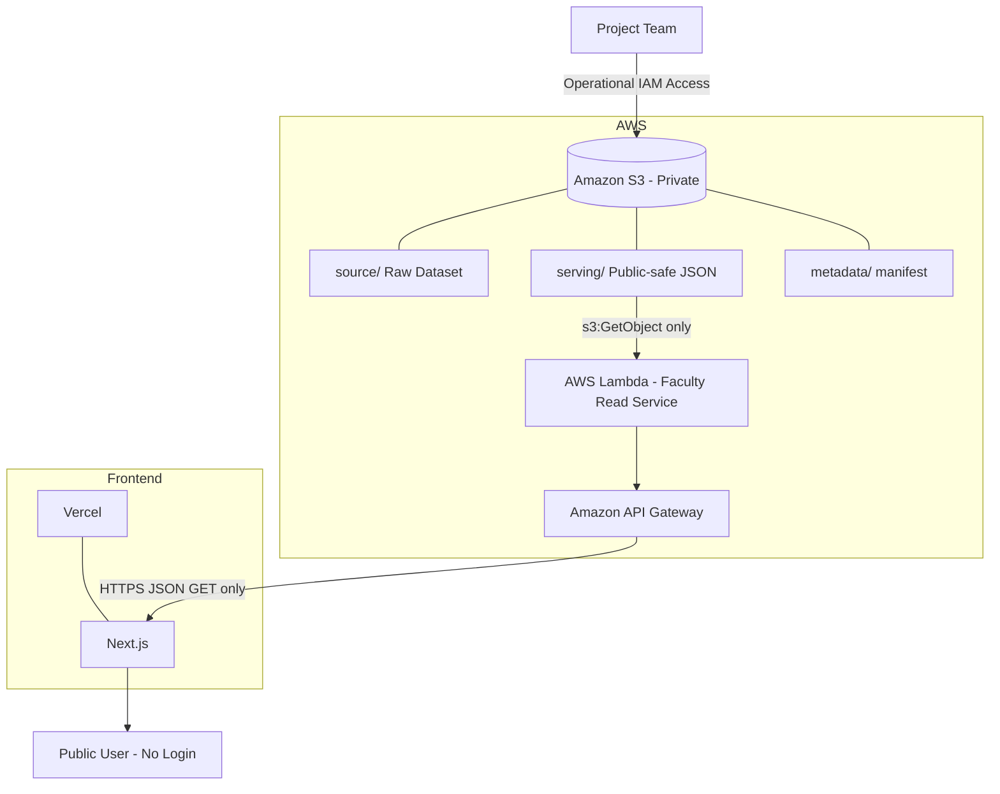

# [V1] Define V1 Scope, Architecture & Technical Contracts — Central V1 Contract

**Project:** Faculty Output & Workload Management System  
**Issue:** #21 — `[V1] Define V1 Scope, Architecture & Technical Contracts`  
**Document Version:** 1.0  
**Date:** 2026-08-26  
**Status:** **Ready for Team Review / Contract Freeze**  
**Primary Owner:** Tech Lead / Cloud Architect / Full-stack Developer  
**Reviewers:** Data Developer, Backend Developer, Frontend Developer, Cloud/AWS Developer  

---

# 0. Document Purpose

เอกสารฉบับนี้เป็น **เอกสารกลาง (Central Technical Contract) ของ V1** สำหรับกำหนดขอบเขต สถาปัตยกรรม Technical Contract และข้อตกลงระหว่าง Data, Backend, Cloud และ Frontend ก่อนเริ่ม Implementation จริง

เป้าหมายของเอกสารคือทำให้สมาชิกในทีมสามารถพัฒนางานของตนเองได้จาก Contract เดียวกัน โดยไม่ต้องตีความใหม่ระหว่างทางว่า

- V1 ทำอะไรและไม่ทำอะไร
- User คนใดสามารถทำอะไรได้
- ข้อมูลใดเป็น Public หรือ Private
- Source Data และ Serving Data ต่างกันอย่างไร
- Runtime อ่านข้อมูลจากที่ใด
- API มี Endpoint อะไร
- API Response มีรูปแบบใด
- Frontend ใช้ Route ใด
- Lambda เข้าถึง S3 ส่วนใด
- Public User เข้าถึง S3 ได้หรือไม่
- Environment Variable ใดเป็น Contract
- CORS ต้องเปิดให้ Origin ใด
- Architecture เลือก Next.js / Vercel / API Gateway / Lambda / S3 เพราะอะไร
- V1 จะต่อยอดไป V2 และ V3 โดยไม่ Over-engineer ได้อย่างไร

เอกสารนี้เป็น **Architecture / Scope Gate** ของ V1 และเป็นต้นทางของ Issue #22–#28

> เมื่อเอกสารนี้ผ่าน Team Review และถูก Freeze แล้ว การเปลี่ยน Contract ที่กระทบหลาย Layer ต้องผ่านการหารือร่วมกับผู้รับผิดชอบที่ได้รับผลกระทบ

---

# 1. Requirement Basis

## 1.1 Course Requirement ที่ V1 ต้องตอบโดยตรง

V1 ถูกออกแบบเพื่อรองรับ Requirement ต่อไปนี้:

> ผู้ใช้ทั่วไปสามารถเข้าถึงข้อมูลพื้นฐานของอาจารย์และผลงานบางส่วนที่กำหนดให้เผยแพร่ได้ เช่น ข้อมูลความเชี่ยวชาญ ผลงานวิจัย หรือกิจกรรมทางวิชาการ โดยยังไม่จำเป็นต้องเข้าสู่ระบบ

Requirement นี้สอดคล้องกับ Functional Requirement หลักของ V1:

> **FR1 — ผู้ใช้ทั่วไปสามารถดูข้อมูลประวัติอาจารย์และผลงานบางส่วนที่กำหนดให้เผยแพร่ได้**

ดังนั้น V1 ต้องมุ่งเน้นที่ **Public Read-only Information Access** เท่านั้น

---

## 1.2 V1 Product Definition

V1 ถูกกำหนดเป็น:

> **Public Read-only Faculty Information Service**

หน้าที่หลักคือให้ Public User สามารถค้นพบและอ่านข้อมูล Faculty ที่ได้รับอนุญาตให้เผยแพร่ได้ โดยไม่ต้อง Login และไม่มีความสามารถในการแก้ไขข้อมูล

V1 ไม่ใช่ระบบ Faculty Output Repository เต็มรูปแบบ  
V1 ไม่ใช่ระบบ Workload Management  
V1 ไม่ใช่ Secure Faculty Workspace  
V1 ไม่ใช่ Department Reporting Platform

Feature เหล่านั้นถูกกำหนดไว้ใน Version ถัดไป

---

# 2. V1 Goal

## 2.1 Primary Goal

สร้างระบบ Public Web Application ที่ผู้ใช้ทั่วไปสามารถ:

1. เปิดเว็บไซต์ได้โดยไม่ Login
2. ดู Faculty Directory
3. ดูข้อมูล Summary ของอาจารย์
4. เลือก Faculty ที่สนใจ
5. เปิด Faculty Profile
6. ดูข้อมูล Public Profile
7. ดู Education
8. ดู Research Interests
9. ดู Expertise
10. ดู Selected Publications / Public Academic Outputs
11. เปิด Public CV เมื่อได้รับอนุญาต
12. เปิด Google Scholar / ResearchGate / Public Academic Profile เมื่อมีข้อมูล

---

## 2.2 System Quality Goal สำหรับ V1

V1 ต้องมีคุณสมบัติระดับ Architecture ดังนี้:

- **Read-only** — ไม่มี Public Data Mutation
- **Public-safe** — Runtime ส่งออกเฉพาะข้อมูลที่อนุญาตให้ Public
- **Simple** — ไม่เพิ่ม Database / Authentication โดยไม่มี Requirement
- **Least Privilege** — Lambda อ่านเฉพาะ Serving Data ที่จำเป็น
- **Clear Boundary** — Source, Serving, API, Frontend แยกหน้าที่ชัด
- **Low Operational Complexity** — เหมาะกับ V1 และเวลาพัฒนา
- **Evolvable** — สามารถเปลี่ยน Data Layer ใน V2 และเพิ่ม Auth ใน V3 ได้
- **No Direct S3 Public Access** — Public User เข้าถึงผ่าน API Boundary เท่านั้น

---

# 3. V1 Scope Freeze

## 3.1 In Scope

### A. Public Frontend

- Faculty Directory
- Faculty Profile
- Faculty Cards
- Faculty Basic Information
- Public Output Sections
- External Public Academic Links
- Public CV Link เมื่อมีสิทธิ์เผยแพร่
- Responsive UI
- Loading State
- Empty State
- Error State
- Not Found State
- Basic Accessibility Behavior
- Browser-based Public Access โดยไม่ Login

### B. Faculty Information

V1 รองรับ Concept ต่อไปนี้:

- Faculty ID
- Thai Name
- English Name
- Academic Position / Academic Title
- Profile Image
- Academic Badge ถ้ามี
- Public CV ถ้าได้รับอนุญาต
- Public Contact
- Education
- Research Interests
- Expertise
- Selected Publications
- Academic Year สำหรับ Public Output เมื่อข้อมูลรองรับ
- Google Scholar
- ResearchGate
- Public Academic Profile Links

### C. Data

- Department Source Dataset
- Source Dataset Inventory
- Source Validation
- Required / Optional Classification
- Public / Private / Pending Classification
- Data Normalization
- Data Sanitization
- Deduplication
- Faculty ID generation/validation rule
- Public-safe Serving JSON
- Dataset Metadata / Manifest หากทีมเลือกใช้
- Amazon S3 logical storage boundary

### D. Backend / Cloud

- Amazon S3
- AWS Lambda
- Amazon API Gateway
- AWS IAM
- Public Read-only API
- Least Privilege
- Private S3 Storage
- Source / Serving Boundary
- CORS between Vercel and API Gateway
- Safe Error Handling

### E. Frontend Technology / Hosting

- Next.js
- Vercel

---

## 3.2 Out of Scope

V1 **ไม่รองรับและต้องไม่ Implement เพียงเพื่อเตรียม Version ถัดไป**:

### Authentication / Identity

- Authentication
- Faculty Login
- Staff Login
- Admin Login
- Cognito
- Role Management
- Permission Management สำหรับผู้ใช้ระบบ
- Session Management

### Mutation / Repository

- Create Faculty
- Edit Faculty
- Delete Faculty
- Faculty Self-Service
- Add Publication ผ่าน Public Application
- Edit Publication ผ่าน Public Application
- Delete Publication ผ่าน Public Application
- Database Repository
- Managed Multi-year Repository

### Workload / Internal Process

- Workload Management
- Teaching Workload
- Student Supervision Management
- Evidence Upload
- Approval Workflow
- Reviewer Workflow
- Faculty Verification Workflow

### Department / Reporting

- Department Dashboard
- Department Reporting
- Aggregation ข้ามหลายปี
- Annual Report Generation
- Workload Sheet Generation
- Management Dashboard

### Advanced Capability

- Advanced Search
- Advanced Expertise Filter
- Full-text Search
- Recommendation Engine
- Automatic Synchronization
- External System Sync
- Infrastructure as Code
- Advanced Performance Optimization
- Complex Caching Infrastructure

---

## 3.3 Scope Guardrail

หาก Feature ใดไม่จำเป็นต่อ FR1 หรือ V1 Public Profile / Public Output Requirement ให้ถือว่า **Out of Scope จนกว่าจะมีการเปลี่ยน Scope อย่างเป็นทางการ**

ตัวอย่าง:

```text
"เราอาจใช้ใน V3" ≠ เหตุผลที่ต้องสร้างใน V1
"อนาคตอาจมี Admin" ≠ ต้องสร้าง Role table ใน V1
"อนาคตอาจมี Database" ≠ ต้องเพิ่ม Database ใน V1
```

---

# 4. V1 Actors

## 4.1 Public User

ตัวอย่าง:

- นักศึกษา
- บุคคลทั่วไป
- ผู้สนใจข้อมูลอาจารย์
- ผู้สนใจงานวิจัยหรือความเชี่ยวชาญ

### Allowed

```text
Read Website                  ✅
View Faculty Directory        ✅
View Faculty Profile          ✅
View Public Outputs           ✅
Open Public Links             ✅
Open Public CV                ✅ เมื่ออนุญาต
```

### Not Allowed / Not Available

```text
Login                         ❌ ไม่จำเป็นใน V1
Create Data                   ❌
Update Data                   ❌
Delete Data                   ❌
Upload Dataset                ❌
Trigger Import                ❌
Access Source S3              ❌
Access Serving S3 Directly    ❌
Access Internal Metadata      ❌
```

---

## 4.2 Project Team

Project Team เป็น Operational Actor ไม่ใช่ Public Application Actor

รับผิดชอบ:

- Source Dataset Preparation
- Dataset Validation
- Public / Private Classification
- Serving JSON Generation
- Upload Source / Serving Data
- S3 Management
- Lambda Deployment
- API Gateway Configuration
- IAM Configuration
- Frontend Deployment
- Integration Testing
- Demo Preparation

V1 **ไม่ต้องสร้าง account ในระบบ** สำหรับ:

- Faculty
- Staff
- Reviewer
- Administrator
- Department Manager

---

# 5. Primary User Journey

```text
Open Public Application
        ↓
Faculty Directory
        ↓
Review Faculty Cards
        ↓
Select Faculty
        ↓
Faculty Profile
        ↓
Review Basic Information
        ↓
Review Public Contact / Education
        ↓
Review Research Interests
        ↓
Review Expertise
        ↓
Review Selected Publications / Public Outputs
        ↓
Open CV / Google Scholar / ResearchGate
```

ไม่มี:

```text
Login
Create
Edit
Delete
Approve
Upload
Submit
Review Workflow
```

---

# 6. Technology Stack Decision

| Layer | Technology | Responsibility | V1 Decision |
|---|---|---|---|
| Frontend | Next.js | Faculty Directory / Profile / UI | Selected |
| Frontend Hosting | Vercel | Build / Deploy Next.js | Selected |
| Public API | Amazon API Gateway | Public HTTPS Interface | Selected |
| Backend | AWS Lambda | Faculty Read Logic | Selected |
| Data Storage | Amazon S3 | Source + Serving Data | Selected |
| Access Control | AWS IAM | Runtime Least Privilege | Selected |
| Source Format | CSV / Excel / Files | Department Source Dataset | Supported |
| Serving Format | JSON | Runtime Public-safe Data | Selected |
| Database | None | Not required in V1 | Explicitly excluded |
| Authentication | None | Public access only | Explicitly excluded |

---

# 7. Architecture Principles

## AP-01 — Public Information Does Not Mean Public Storage

```text
Public Information
        ≠
Public Storage
```

ข้อมูลอาจได้รับอนุญาตให้เผยแพร่ แต่ Storage ไม่จำเป็นต้อง Public

---

## AP-02 — Runtime Uses Public-safe Serving Data Only

Runtime ต้องไม่อ่าน Raw Source Dataset แล้วพยายาม Filter Privacy ทุก Request

หลักการคือ:

```text
Source Data
   ↓
Prepare / Sanitize
   ↓
Serving Data
   ↓
Runtime
```

---

## AP-03 — Private Data Must Be Removed Before Frontend

ห้ามใช้แนวทาง:

```text
Private + Public Data
        ↓
Frontend
        ↓
Hide Private Fields
```

ต้องใช้:

```text
Source Data
        ↓
Remove Non-public Fields
        ↓
Public-safe Serving Data
        ↓
API
        ↓
Frontend
```

---

## AP-04 — Read-only End-to-End

Public Runtime ไม่มี Mutation Path

```text
GET ✅
POST ❌
PUT ❌
PATCH ❌
DELETE ❌
```

---

## AP-05 — Least Privilege

Lambda ต้องได้เฉพาะ Permission ที่จำเป็นต่อ Runtime

---

## AP-06 — Version Boundary First

V1 ทำเฉพาะสิ่งที่ V1 ต้องใช้ ไม่ Implement Feature ของ V2/V3 ล่วงหน้า

---

# 8. High-Level System Architecture

## 8.1 ASCII Architecture

```text
                         PROJECT TEAM
                              │
                              │ controlled operational access
                             IAM
                              │
                              ▼
                 ┌────────────────────────┐
                 │       Amazon S3        │
                 │        PRIVATE         │
                 │                        │
                 │ source/                │
                 │ ├─ CSV / Excel         │
                 │ └─ Original Assets     │
                 │                        │
                 │ serving/               │
                 │ ├─ faculties.json      │
                 │ └─ faculties/{id}.json │
                 │                        │
                 │ metadata/              │
                 │ └─ manifest.json       │
                 │                        │
                 │ Public-safe Serving    │
                 └───────────┬────────────┘
                             │
                       s3:GetObject
                       serving/* only
                             │
                             ▼
                 ┌────────────────────────┐
                 │      AWS Lambda        │
                 │                        │
                 │ Faculty Read Service   │
                 │                        │
                 │ - List Faculty         │
                 │ - Faculty Detail       │
                 │ - ID Validation        │
                 │ - Safe Error Handling  │
                 │ - Public Fields Only   │
                 └───────────┬────────────┘
                             │
                             ▼
                 ┌────────────────────────┐
                 │  Amazon API Gateway    │
                 │                        │
                 │ GET /api/v1/faculties │
                 │ GET /api/v1/           │
                 │     faculties/{id}     │
                 └───────────┬────────────┘
                             │
                         HTTPS / JSON
                             │
                             ▼
                 ┌────────────────────────┐
                 │       Next.js          │
                 │    Deploy on Vercel    │
                 │                        │
                 │ Faculty Directory      │
                 │ Faculty Profile        │
                 │ Public Outputs         │
                 └───────────┬────────────┘
                             │
                             ▼
                         PUBLIC USER
                          NO LOGIN
                          READ ONLY
```

---

## 8.2 Mermaid Architecture



---

# 9. Component Responsibility Contract

| Component | Must Do | Must NOT Do |
|---|---|---|
| Next.js | Render Directory/Profile, call API, navigation, UI states, responsive UI | Read S3 directly, store AWS credential, implement source data logic |
| Vercel | Build/deploy frontend, host public web app, frontend environment config | Store backend secrets in client-exposed variables |
| API Gateway | Expose public HTTPS GET routes, route to Lambda, enforce method boundary, CORS | Expose mutation business API |
| AWS Lambda | Read Serving JSON, validate ID, return safe JSON, safe errors | Write/delete S3, read source runtime, expose internal error details |
| Amazon S3 | Store source/serving/metadata privately | Allow anonymous direct public access |
| AWS IAM | Grant least privilege | Grant broad `s3:*` to Lambda |
| Project Team | Prepare/publish dataset, deploy components | Depend on Public Application for dataset administration |

---

# 10. Data Architecture

## 10.1 Data Layers

V1 แยกข้อมูลเป็น 3 Logical Areas

### A. Source Data

```text
source/
```

เก็บ:

- Original Excel
- Original CSV
- Original files
- Original assets
- Input dataset จากสาขาวิชา

Source Data เป็นข้อมูลต้นทางและ **ไม่ใช่ Runtime Public Dataset**

---

### B. Serving Data

```text
serving/
```

เก็บ JSON ที่ผ่านการเตรียมแล้ว

ขั้นต่ำ:

```text
serving/faculties.json
serving/faculties/{id}.json
```

Serving Data ต้องเป็น **Public-safe Data Only**

---

### C. Metadata

```text
metadata/
```

ใช้สำหรับข้อมูลเกี่ยวกับ Dataset เช่น:

- lastUpdated
- generatedAt
- sourceVersion
- facultyCount
- generationVersion

ใช้เฉพาะเมื่อทีมเลือกใช้ Manifest Contract

---

## 10.2 Data Preparation Boundary

```text
Department Dataset
        ↓
Inventory
        ↓
Validate
        ↓
Classify Public / Private / Pending
        ↓
Normalize
        ↓
Deduplicate
        ↓
Validate URLs / IDs
        ↓
Sanitize
        ↓
Select Public Fields
        ↓
Generate Serving JSON
        ↓
Upload to S3 serving/
```

Public User ไม่สามารถ Trigger Process นี้

---

# 11. S3 Logical Structure Contract

```text
faculty-v1-data/
│
├── source/
│   ├── current/
│   │   ├── faculties.xlsx
│   │   ├── publications.csv
│   │   └── assets/
│   │
│   └── archive/
│
├── serving/
│   ├── faculties.json
│   └── faculties/
│       ├── faculty-a.json
│       ├── faculty-b.json
│       └── ...
│
└── metadata/
    └── manifest.json
```

## 11.1 Boundary Rules

- `source/*` = Private / Operational
- `serving/*` = Public-safe information แต่ S3 object ยัง Private
- `metadata/*` = Internal/Operational by default เว้นแต่ explicitly exposed
- Public User ไม่มี S3 permission
- Lambda อ่านเฉพาะ `serving/*`
- Project Team สามารถมีสิทธิ์เขียน Source/Serving ตามหน้าที่
- Bucket-level Block Public Access ต้องเปิดใช้งานใน Implementation

---

# 12. Public / Private Data Boundary

## 12.1 Public Candidate Fields

ข้อมูลต่อไปนี้ **อาจ** เป็น Public เมื่อ Source Owner / Dataset Classification ยืนยันแล้ว:

- Faculty ID
- Thai Name
- English Name
- Academic Position
- Faculty Image
- Academic Badge
- Public Office
- Public Phone
- Public Email
- Education
- Research Interests
- Expertise
- Selected Publications
- Academic Year
- Public CV
- Google Scholar
- ResearchGate
- Public Academic Profile

คำว่า "อาจ" สำคัญ: ข้อมูลที่ยังไม่ได้รับการยืนยันสถานะต้องไม่ถูกสมมติว่า Public

---

## 12.2 Private / Internal Data

ห้ามออกผ่าน Public API:

- Raw Source Dataset
- Private contact information
- Internal Notes
- Teaching Workload
- Workload Score
- Student Information
- Student Supervision Internal Data
- Review Information
- Approval Information
- Evidence files ที่ไม่ใช่ Public
- Source File Paths
- S3 Internal Key ที่ไม่จำเป็นต่อ Public Contract
- AWS Credentials
- Environment Secrets
- Internal Configuration
- Stack Trace
- Raw Exceptions

---

# 13. Faculty Identifier Strategy

Faculty ID เป็น Contract สำคัญระหว่าง:

```text
Source → Serving JSON → S3 Key → API Path → Frontend Route
```

## 13.1 Requirements

Faculty ID ต้อง:

- Unique
- Stable
- URL-safe
- Case convention ชัดเจน
- ไม่เปลี่ยนเพราะ Academic Title เปลี่ยน
- ไม่ขึ้นกับ Array Index
- ไม่ใช้ข้อมูล Sensitive
- ป้องกัน Path Traversal
- ใช้เป็น S3 filename ได้

## 13.2 Recommended Format

ใช้ slug ภาษาอังกฤษแบบ lowercase:

```text
prapaporn-rattanatamrong
somchai-jaidee
```

Recommended validation:

```regex
^[a-z0-9]+(?:-[a-z0-9]+)*$
```

## 13.3 Explicitly Invalid

```text
../source/private.csv
faculty/../../secret
ABC DEF
a/b
```

Detailed mapping และ collision resolution ต้อง Freeze ใน Issue #22

---

# 14. High-Level Faculty Data Contract

> หมายเหตุ: Section นี้กำหนด **High-Level Contract ของ #21**  
> Source-to-Serving Mapping, Required/Optional Rules และ field-level validation จะ Freeze ต่อใน #22

## 14.1 Faculty Summary Contract

ใช้กับ:

```text
serving/faculties.json
GET /api/v1/faculties
Faculty Directory
```

Conceptual shape:

```json
{
  "id": "prapaporn-rattanatamrong",
  "thaiName": "รศ. ดร. ...",
  "englishName": "Assoc. Prof. ...",
  "academicPosition": "Associate Professor",
  "profileImageUrl": "https://...",
  "expertise": [
    "Artificial Intelligence",
    "Computer Vision"
  ]
}
```

ขั้นต่ำ UI ต้องสามารถ:

- ระบุตัว Faculty
- แสดงชื่อ
- แสดง Academic Position ถ้ามี
- แสดงรูปหรือ fallback
- แสดง Expertise summary ถ้ามี
- Navigate ไป Faculty Profile

---

## 14.2 Faculty Detail Contract

ใช้กับ:

```text
serving/faculties/{id}.json
GET /api/v1/faculties/{id}
/faculties/{id}
```

Conceptual shape:

```json
{
  "id": "prapaporn-rattanatamrong",
  "thaiName": "รศ. ดร. ...",
  "englishName": "Assoc. Prof. ...",
  "academicPosition": "Associate Professor",
  "profileImageUrl": "https://...",
  "badges": [],
  "cvUrl": "https://...",
  "contact": {
    "office": "...",
    "phone": "...",
    "email": "..."
  },
  "education": [
    {
      "degree": "Ph.D.",
      "field": "Computer Science",
      "institution": "...",
      "year": "..."
    }
  ],
  "researchInterests": [
    "Artificial Intelligence"
  ],
  "expertise": [
    "Computer Vision"
  ],
  "selectedPublications": [
    {
      "title": "...",
      "year": 2025,
      "academicYear": "2025",
      "type": "Journal",
      "url": "https://..."
    }
  ],
  "academicProfiles": {
    "googleScholar": "https://...",
    "researchGate": "https://...",
    "other": []
  }
}
```

---

## 14.3 Conceptual Entity Tree

```text
Faculty
│
├── Identity
│   ├── ID
│   ├── Thai Name
│   ├── English Name
│   └── Academic Position
│
├── Media
│   ├── Profile Image
│   └── Badges
│
├── Curriculum Vitae
│
├── Contact
│   ├── Office
│   ├── Phone
│   └── Email
│
├── Education[]
│
├── Research Interests[]
│
├── Expertise[]
│
├── Selected Publications[]
│   ├── Title
│   ├── Type
│   ├── Year
│   ├── Academic Year
│   └── Public URL
│
└── Academic Profiles
    ├── Google Scholar
    ├── ResearchGate
    └── Other Public Profiles[]
```

---

## 14.4 Missing Optional Data Rule

High-level rule:

- Missing optional data ต้องไม่ทำให้ API crash
- Missing optional data ต้องไม่ทำให้ UI crash
- Frontend ต้องไม่ render placeholder ที่ทำให้เข้าใจผิด
- Empty array ใช้ได้สำหรับ list field ที่ไม่มีข้อมูล
- Detailed null/omission convention ต้อง Freeze ใน #22

ตัวอย่าง:

```json
{
  "education": [],
  "expertise": [],
  "selectedPublications": []
}
```

---

# 15. Frontend Contract

## 15.1 Route Decision

### Faculty Directory

**Canonical route:**

```text
/faculties
```

### Faculty Profile

```text
/faculties/{id}
```

ตัวอย่าง:

```text
/faculties/prapaporn-rattanatamrong
```

### Root Route

Recommended:

```text
/
```

ให้ redirect หรือ navigate ไป `/faculties`

เหตุผล: ทำให้ Route Contract ชัดเจนและพร้อมสำหรับการเพิ่มหน้าอื่นใน Version ถัดไปโดยไม่ให้ `/` มี semantics ที่ผูกติดเกินไป

---

## 15.2 UI State Contract

ทุก Data-driven Page ต้องรองรับ:

### Loading

- แสดง loading UI
- ไม่แสดง stale error
- ไม่แสดง incomplete content เป็น success

### Empty

Faculty Directory:

- API สำเร็จ
- `data = []`
- แสดงข้อความว่าไม่มีข้อมูลที่เผยแพร่

Faculty Profile section:

- optional list ว่าง
- ซ่อน section หรือแสดง empty-state ที่เหมาะสม

### Error

- API failure
- แสดง user-safe error
- ให้ Retry หากเหมาะสม
- ไม่แสดง stack trace

### Not Found

- Unknown Faculty ID
- API `404`
- UI แสดง Faculty Not Found
- ไม่ใช้ generic 500 page

### Success

- Render จาก API Contract
- ไม่มี hard-coded production faculty data

---

# 16. Public API Contract

## 16.1 Namespace

V1 Public API ใช้:

```text
/api/v1/
```

เหตุผล:

- แยก API Contract ของ V1
- รองรับ evolution ใน Version ถัดไป
- ลด Breaking Change โดยไม่ตั้งใจ

---

## 16.2 Faculty List

```http
GET /api/v1/faculties
```

### Purpose

Return Faculty Summary สำหรับ Faculty Directory

### Success

```http
200 OK
Content-Type: application/json
```

```json
{
  "data": [
    {
      "id": "prapaporn-rattanatamrong",
      "thaiName": "...",
      "englishName": "...",
      "academicPosition": "...",
      "profileImageUrl": "https://...",
      "expertise": ["Computer Vision"]
    }
  ]
}
```

### Empty Dataset

```http
200 OK
```

```json
{
  "data": []
}
```

---

## 16.3 Faculty Detail

```http
GET /api/v1/faculties/{id}
```

### Purpose

Return complete Public Faculty Profile สำหรับ Faculty Profile Page

### Success

```http
200 OK
Content-Type: application/json
```

```json
{
  "data": {
    "id": "prapaporn-rattanatamrong",
    "thaiName": "...",
    "englishName": "...",
    "academicPosition": "...",
    "education": [],
    "researchInterests": [],
    "expertise": [],
    "selectedPublications": []
  }
}
```

---

## 16.4 Health Check Decision

V1 เลือกให้ Health Check เป็น **Optional Infrastructure Endpoint**

```http
GET /health
```

หรือ

```http
GET /api/v1/health
```

ทีมสามารถใช้เพื่อ Demo / Deployment Smoke Test ได้ แต่:

- ไม่ใช่ Business Requirement
- ไม่จำเป็นต่อ Faculty User Journey
- หากไม่ Implement ต้องบันทึก Decision ไว้
- หาก Implement Response ต้องไม่มี infrastructure secret

Recommended response:

```json
{
  "status": "ok"
}
```

---

# 17. Response Convention

## 17.1 Collection Success

```json
{
  "data": []
}
```

## 17.2 Single Resource Success

```json
{
  "data": {}
}
```

## 17.3 Error

```json
{
  "error": {
    "code": "FACULTY_NOT_FOUND",
    "message": "Faculty not found"
  }
}
```

---

# 18. HTTP Status Contract

| Case | HTTP Status | Error Code |
|---|---:|---|
| Faculty list success | 200 | — |
| Faculty list empty | 200 | — |
| Faculty detail success | 200 | — |
| Invalid Faculty ID format | 400 | `INVALID_FACULTY_ID` |
| Faculty does not exist | 404 | `FACULTY_NOT_FOUND` |
| Unsupported HTTP method | 405 | `METHOD_NOT_ALLOWED` |
| Invalid serving JSON / internal data failure | 500 | `INTERNAL_ERROR` |
| S3 unexpected error | 500 | `INTERNAL_ERROR` |
| Unexpected Lambda error | 500 | `INTERNAL_ERROR` |

---

# 19. Error Safety Contract

Public Error Response ห้ามเปิดเผย:

- Stack Trace
- S3 Bucket Internal Details ที่ไม่จำเป็น
- Raw S3 Key จาก source
- AWS Account ID
- AWS Credential
- Environment Variable Value
- Raw Exception
- Source File Path
- Internal Config
- Local File Path
- Implementation-specific secret

ตัวอย่าง Public-safe 500:

```json
{
  "error": {
    "code": "INTERNAL_ERROR",
    "message": "Unable to load faculty information"
  }
}
```

---

# 20. Public Read-only API Boundary

Business API รองรับ:

```text
GET ✅
```

ไม่รองรับ:

```text
POST   ❌
PUT    ❌
PATCH  ❌
DELETE ❌
```

ต้องไม่มี V1 Endpoint เช่น:

```http
POST /api/v1/faculties
PUT /api/v1/faculties/{id}
PATCH /api/v1/faculties/{id}
DELETE /api/v1/faculties/{id}
POST /api/v1/import
POST /api/v1/publications
```

---

# 21. Runtime Request Flows

## 21.1 Faculty Directory

```text
Public User
      ↓
Next.js on Vercel
      ↓
GET /api/v1/faculties
      ↓
API Gateway
      ↓
Lambda
      ↓
S3 serving/faculties.json
      ↓
Lambda Public-safe Response
      ↓
API Gateway
      ↓
Next.js
      ↓
Faculty Directory
```

---

## 21.2 Faculty Profile

```text
Public User
      ↓
Select Faculty
      ↓
/faculties/{id}
      ↓
Next.js
      ↓
GET /api/v1/faculties/{id}
      ↓
API Gateway
      ↓
Lambda
      ↓
Validate Faculty ID
      ↓
S3 serving/faculties/{id}.json
      ↓
Lambda Public-safe Response
      ↓
API Gateway
      ↓
Next.js
      ↓
Faculty Profile
```

---

## 21.3 Unknown Faculty

```text
/faculties/unknown-id
      ↓
GET /api/v1/faculties/unknown-id
      ↓
Lambda
      ↓
Serving object not found
      ↓
404 FACULTY_NOT_FOUND
      ↓
Frontend Not Found State
```

---

# 22. Security Boundary

## 22.1 Security Zones

```text
PUBLIC ZONE
Public User
    ↓
Vercel / Next.js
    ↓
API Gateway

TRUSTED RUNTIME ZONE
API Gateway
    ↓
AWS Lambda
    ↓
S3 serving/*

OPERATIONAL / PRIVATE ZONE
Project Team
    ↓
S3 source/*
S3 metadata/*
Deployment configuration
```

---

## 22.2 S3 Security Contract

- S3 Bucket = Private
- Block Public Access = Enabled
- No anonymous direct read
- Public User ไม่มี S3 access
- Serving data accessed via Lambda only
- Source data never public
- Frontend ไม่มี AWS credential

---

# 23. IAM / Least Privilege Contract

## 23.1 Lambda Required Permission

Minimum runtime permission:

```text
s3:GetObject
```

เฉพาะ:

```text
arn:aws:s3:::<DATA_BUCKET_NAME>/serving/*
```

Conceptual IAM policy:

```json
{
  "Version": "2012-10-17",
  "Statement": [
    {
      "Effect": "Allow",
      "Action": [
        "s3:GetObject"
      ],
      "Resource": [
        "arn:aws:s3:::<DATA_BUCKET_NAME>/serving/*"
      ]
    }
  ]
}
```

---

## 23.2 Lambda Must NOT Have

```text
s3:*
s3:PutObject
s3:DeleteObject
```

และไม่ควรมี:

```text
s3:GetObject source/*
```

---

## 23.3 Actor–Resource–Permission Matrix

| Actor | Resource | Required Action | Must NOT Be Allowed | Mechanism |
|---|---|---|---|---|
| Public User | Next.js Website | Read | Modify | Public HTTPS |
| Public User | API Gateway | GET | POST / PUT / PATCH / DELETE | API Route/Method Boundary |
| Public User | Amazon S3 | None | Direct Access | S3 Private + Block Public Access |
| Lambda | `serving/*` | `s3:GetObject` | Put / Delete | IAM Role |
| Lambda | `source/*` | None | Read / Write | No Permission |
| Project Team | `source/*` | Get / Put ตามหน้าที่ | Unrelated AWS Resources | IAM |
| Project Team | `serving/*` | Get / Put ตามหน้าที่ | Unrelated AWS Resources | IAM |
| Frontend Runtime | AWS Services | None | AWS Credential Use | No AWS Credential |

---

# 24. Faculty ID Security Validation

Faculty ID จาก URL ต้องถูก Validate ก่อนประกอบ S3 Key

Allowed:

```text
^[a-z0-9]+(?:-[a-z0-9]+)*$
```

Reject:

```text
..
/
\
%2e%2e
encoded traversal patterns
unexpected path separators
```

เป้าหมายคือไม่ให้ request:

```text
/api/v1/faculties/../../source/private
```

สามารถเปลี่ยน S3 target ออกจาก:

```text
serving/faculties/{id}.json
```

---

# 25. Environment Contract

## 25.1 Frontend

Required:

```env
NEXT_PUBLIC_API_BASE_URL=
```

Example:

```env
NEXT_PUBLIC_API_BASE_URL=https://api.example.com
```

Rule:

`NEXT_PUBLIC_*` เป็น Client-visible ดังนั้นต้องไม่มี Secret

---

## 25.2 Lambda / Backend

Freeze variable names:

```env
DATA_BUCKET_NAME=
SERVING_PREFIX=serving
```

Optional if manifest is used:

```env
METADATA_PREFIX=metadata
```

---

## 25.3 Secret Rules

```text
❌ ห้าม Commit AWS Secret
❌ ห้าม Hard-code AWS Access Key
❌ ห้ามใส่ Secret ใน NEXT_PUBLIC_*
❌ ห้ามใส่ credential จริงใน .env.example

✅ Lambda ใช้ IAM Role
✅ Vercel Frontend เก็บเฉพาะ API Base URL ที่เปิดเผยได้
✅ Sensitive deployment configuration ใช้ platform/environment configuration
```

---

# 26. CORS Contract

Frontend และ Backend อยู่คนละ Provider:

```text
Next.js / Vercel
       ↓ cross-origin request
API Gateway / AWS
```

ดังนั้น Production API ต้องอนุญาตเฉพาะ Origin ที่ทีมกำหนด

## 26.1 Development

อนุญาตอย่างน้อย:

```text
http://localhost:3000
```

## 26.2 Production

อนุญาต:

```text
https://<production-vercel-domain>
```

และ Custom Domain หากมี

## 26.3 Methods

```text
GET
OPTIONS
```

หาก Browser/CORS configuration ต้องใช้ preflight

## 26.4 Rules

- ไม่เปิด `*` โดย default ใน Production หากไม่มีเหตุผล
- ไม่อนุญาต mutation methods เพราะ Business API ไม่มี mutation
- ไม่ใช้ `Access-Control-Allow-Credentials: true` หากไม่มี authentication/cookie requirement
- CORS เป็น browser access control ไม่ใช่ authorization mechanism

---

# 27. Contract Between Layers

## 27.1 Data → Backend

Data Team รับผิดชอบ:

```text
serving/faculties.json
serving/faculties/{id}.json
```

Backend ต้องอ่านตาม path contract นี้

---

## 27.2 Backend → Frontend

Backend ส่ง:

```json
{
  "data": ...
}
```

หรือ

```json
{
  "error": {
    "code": "...",
    "message": "..."
  }
}
```

Frontend ต้องไม่พึ่ง internal S3 structure

---

## 27.3 Frontend → Backend

Frontend เรียกผ่าน:

```text
NEXT_PUBLIC_API_BASE_URL
```

และใช้:

```text
GET /api/v1/faculties
GET /api/v1/faculties/{id}
```

---

## 27.4 Public User → Storage

ไม่มี Contract โดยตรง

```text
Public User → S3 = Forbidden
```

---

# 28. Architecture Decisions (ADR)

## ADR-01 — Use Next.js

### Decision

ใช้ Next.js เป็น Frontend Framework

### Reasons

- Component-based development
- รองรับ Faculty Directory
- รองรับ Dynamic Faculty Profile route
- รองรับ responsive application
- Ecosystem เหมาะกับทีม Web
- สามารถ evolve เมื่อ V2/V3 เพิ่มความซับซ้อน

### Trade-off

- Framework complexity มากกว่า static HTML
- ต้องบริหาร environment/build configuration

### Status

Accepted for V1

---

## ADR-02 — Deploy Frontend on Vercel

### Decision

ใช้ Vercel สำหรับ Next.js Deployment

### Reasons

- Native Next.js deployment
- Setup เร็ว
- Preview/Production deployment ง่าย
- ลด frontend infrastructure complexity
- เหมาะกับ V1 timeline

### Trade-off

- Multi-provider Architecture
- Backend อยู่ AWS แต่ Frontend อยู่ Vercel
- ต้องจัดการ CORS และ Environment แยกกัน

### Status

Accepted for V1

---

## ADR-03 — Use Amazon API Gateway

### Decision

ใช้ Amazon API Gateway เป็น Public Backend Entry Point

### Reasons

- แยก Public Web จาก Storage
- ให้ Public API Boundary ชัดเจน
- Route request ไป Lambda
- รองรับ HTTPS endpoint
- ทำ method/CORS boundary ได้
- API boundary สามารถอยู่ต่อได้แม้ Data Layer เปลี่ยนใน V2

### Trade-off

- เพิ่ม AWS component
- ต้อง configure CORS/route/integration

### Status

Accepted for V1

---

## ADR-04 — Use AWS Lambda

### Decision

ใช้ AWS Lambda เป็น Faculty Read Service

### Reasons

V1 มี Backend logic จำกัด:

- List Faculty
- Faculty Detail
- Validate ID
- Read S3
- Error handling

ไม่ต้องการ dedicated server

### Trade-off

- Cold-start เป็นไปได้
- Local debugging แตกต่างจาก server แบบ long-running
- ต้องออกแบบ IAM role ให้ถูกต้อง

### Status

Accepted for V1

---

## ADR-05 — Use Amazon S3 for V1 Data

### Decision

ใช้ S3 เก็บ:

- Source Dataset
- Public-safe Serving JSON
- Dataset Metadata หากมี

### Reasons

- Read-only workload
- Low operational complexity
- Low cost
- Serverless integration กับ Lambda
- ไม่ต้องดูแล database server
- Dataset update frequency ต่ำใน V1

### Trade-off

- Complex query ไม่เหมาะ
- Frequent update ไม่เหมาะ
- Transaction ไม่เหมาะ
- Advanced search/filter ไม่เหมาะ
- Relationship query ไม่เหมาะ

### Status

Accepted for V1

---

## ADR-06 — No Database in V1

### Decision

ไม่ใช้ Database ใน V1

### Reasons

V1 ไม่มี Requirement ด้าน:

- Create
- Update
- Delete
- Transaction
- Faculty Workspace
- Managed Repository
- Multi-user data editing
- Complex query

การเพิ่ม Database ใน V1 จะเพิ่ม complexity โดยยังไม่มี Requirement รองรับ

### Trade-off

เมื่อระบบเข้าสู่ V2 และต้องเป็น managed repository จำเป็นต้องพิจารณา Data Layer ใหม่

### Status

Accepted for V1

---

## ADR-07 — No Authentication in V1

### Decision

ไม่ใช้ Authentication ใน V1

### Reasons

V1 requirement ระบุว่าผู้ใช้ทั่วไปเข้าถึงข้อมูล Public ได้โดยไม่ Login

### Trade-off

ระบบไม่สามารถมี faculty workspace/admin workflow ใน V1

### Status

Accepted for V1

---

## ADR-08 — Private S3 + Public API

### Decision

แม้ข้อมูลบางส่วนจะ Public แต่ S3 ยังคง Private

### Reasons

- ลด Storage exposure
- enforce public data boundary ผ่าน serving layer/API
- ทำ Least Privilege ได้ง่าย
- ป้องกัน raw source exposure

### Status

Accepted for V1

---

# 29. Alternatives Considered

## 29.1 Direct Public S3 Website/Data Access

**Rejected**

เหตุผล:

- ทำ public/private boundary อ่อนลง
- frontend ผูกกับ storage structure
- เปลี่ยน backend/data layer ในอนาคตยากขึ้น
- source/serving exposure risk สูงกว่า

---

## 29.2 Database from V1

**Rejected for V1**

เหตุผล:

- ไม่มี CRUD requirement
- ไม่มี transaction requirement
- เพิ่ม setup/operation
- over-engineering สำหรับ current scope

จะ reconsider ใน V2

---

## 29.3 Dedicated Backend Server

**Rejected for V1**

เหตุผล:

- Backend logic เล็ก
- ต้องดูแล process/server
- เพิ่ม operational overhead

---

## 29.4 Authentication from V1

**Rejected**

เหตุผล:

- ไม่ตอบ Requirement เพิ่ม
- ทำให้ user journey ซับซ้อน
- เป็น V3 concern

---

# 30. Known Limitations

V1 ยอมรับข้อจำกัดต่อไปนี้โดยตั้งใจ:

- No Authentication
- No Database
- No Faculty Editing
- No Admin Portal
- No Workload Management
- No Approval Workflow
- No Reporting
- No Automatic Synchronization
- No Managed Multi-year Repository
- No Advanced Search
- No Advanced Aggregation
- S3 JSON ไม่เหมาะกับ complex query
- Dataset update เป็น operational process ไม่ใช่ user feature

สิ่งเหล่านี้คือ **Version Boundary ไม่ใช่ Bug**

---

# 31. V1 Extension Points

## 31.1 V2 — Faculty Output Repository

V1:

```text
S3 Serving JSON
```

V2 สามารถ evolve เป็น:

```text
Managed Repository / Database
```

API concept อาจคงไว้:

```text
Frontend
   ↓
API Boundary
   ↓
Repository
```

ดังนั้น Frontend ไม่ควรผูกกับ S3 โดยตรง

---

## 31.2 V3 — Secure Faculty Workspace

เพิ่ม:

- Authentication
- Authorization
- Faculty Workspace
- Role-based Access
- Staff / Reviewer / Admin roles
- Approval / Verification workflow ตาม requirement

โดยไม่ต้องมี component เหล่านี้ใน V1

---

## 31.3 V4+

สามารถเพิ่ม:

- Department Aggregation
- Reporting
- Annual Report
- Automation
- Infrastructure as Code
- Performance Optimization
- Integrated Workload System

---

# 32. Dependency and Issue Boundary

## #21 — This Document

ทำ:

```text
Scope Freeze
Architecture Design
Technical Contracts
Security Boundary
Decision Records
```

ไม่ Implement code

---

## #22 — Validate Source Dataset & Define Public Faculty Data Contract

ต่อจาก #21 เพื่อ Freeze:

- source inventory
- field mapping
- required/optional
- public/private/pending
- normalization
- duplicate rules
- detailed JSON schema
- manifest contract
- data gaps

---

## #23 — Data Preparation & S3 Serving Dataset

Implement:

```text
Source → Validate → Normalize → Sanitize → JSON → S3
```

---

## #24 — Read-only Faculty API with Lambda

Implement:

```text
GET /api/v1/faculties
GET /api/v1/faculties/{id}
```

---

## #25 — API Gateway, IAM & Public Read-only Boundary

Implement:

- API Gateway
- CORS
- Lambda IAM
- S3 access boundary
- method restriction

---

## #26 — Public Faculty Directory

Implement:

```text
/faculties
```

---

## #27 — Complete Faculty Profile & Public Outputs

Implement:

```text
/faculties/{id}
```

---

## #28 — Deploy & Validate V1 End-to-End

Verify:

```text
Source
↓
S3
↓
Lambda
↓
API Gateway
↓
Next.js / Vercel
↓
Public User
```

---

## #29 — Final Documentation & Demo Evidence

Finalize evidence จาก implementation จริง

---

# 33. Contract Freeze and Change Control

หลัง Team Review:

1. Document version เปลี่ยนจาก `Ready for Team Review` เป็น `Frozen for V1`
2. ทุกทีมใช้ Contract นี้เป็น baseline
3. Breaking change ต้องระบุ:
   - เหตุผล
   - Layer ที่ได้รับผลกระทบ
   - Migration / update required
   - reviewer
4. Field-level change หลัง #22 Freeze ต้องแจ้ง Data + Backend + Frontend
5. API path/response change ต้องแจ้ง Backend + Frontend
6. S3/IAM boundary change ต้องแจ้ง Data + Backend + Cloud

---

# 34. Team Review Checklist

## Tech Lead

- [ ] Scope ตรง V1 Requirement
- [ ] ไม่มี V2/V3 feature หลุดเข้ามา
- [ ] Architecture ไม่ Over-engineer
- [ ] Decision / Trade-off อธิบายได้

## Data Developer

- [ ] Source/Serving boundary ชัดเจน
- [ ] S3 logical structure implement ได้
- [ ] High-level contract เพียงพอสำหรับเริ่ม #22

## Backend Developer

- [ ] API endpoints ชัดเจน
- [ ] response/error convention ชัดเจน
- [ ] ID validation boundary ชัดเจน
- [ ] S3 read path ชัดเจน

## Frontend Developer

- [ ] routes ชัดเจน
- [ ] summary/detail concept ชัดเจน
- [ ] UI states ชัดเจน
- [ ] API base URL ชัดเจน

## Cloud / AWS Developer

- [ ] S3 private boundary ชัดเจน
- [ ] Lambda IAM scope ชัดเจน
- [ ] API Gateway boundary ชัดเจน
- [ ] CORS boundary ชัดเจน

---

# 35. Issue #21 Task Completion Matrix

Legend:

- ✅ = Defined completely in this document
- ⏳ = Requires actual team execution/sign-off outside the document

## Scope & Requirement

- [x] Review V1 Requirement — ✅ Section 1
- [x] Freeze V1 Goal — ✅ Sections 1–2
- [x] Freeze V1 In Scope — ✅ Section 3.1
- [x] Freeze V1 Out of Scope — ✅ Section 3.2
- [x] Identify V1 Actors — ✅ Section 4
- [x] Define Primary User Journey — ✅ Section 5

## Architecture

- [x] Confirm Next.js as Frontend — ✅ Sections 6, 28
- [x] Confirm Vercel as Frontend Hosting — ✅ Sections 6, 28
- [x] Confirm Amazon API Gateway — ✅ Sections 6, 28
- [x] Confirm AWS Lambda — ✅ Sections 6, 28
- [x] Confirm Amazon S3 — ✅ Sections 6, 28
- [x] Confirm AWS IAM — ✅ Sections 6, 23
- [x] Confirm No Database in V1 — ✅ ADR-06
- [x] Confirm No Authentication in V1 — ✅ ADR-07
- [x] Create High-Level Architecture Diagram — ✅ Section 8
- [x] Define Component Responsibilities — ✅ Section 9

## Data Contract Boundary

- [x] Define Source Data Concept — ✅ Section 10
- [x] Define Serving Data Concept — ✅ Section 10
- [x] Define Source / Serving S3 Prefix — ✅ Section 11
- [x] Define Public / Private Data Boundary — ✅ Section 12
- [x] Define High-Level Faculty Data Contract — ✅ Section 14
- [x] Define Faculty ID Strategy Requirements — ✅ Section 13
- [x] Define Data Preparation Boundary — ✅ Section 10.2

## API Contract

- [x] Define `GET /api/v1/faculties` — ✅ Section 16.2
- [x] Define `GET /api/v1/faculties/{id}` — ✅ Section 16.3
- [x] Decide whether `GET /health` is required — ✅ Section 16.4: Optional, not business requirement
- [x] Define Success Response Convention — ✅ Section 17
- [x] Define Error Response Convention — ✅ Sections 17–19
- [x] Define HTTP Status Behavior — ✅ Section 18
- [x] Confirm API Namespace `/api/v1/` — ✅ Section 16.1
- [x] Confirm Public API is Read-only — ✅ Section 20

## Frontend Contract

- [x] Define Faculty Directory Route — ✅ `/faculties`, Section 15
- [x] Define Faculty Profile Route — ✅ `/faculties/{id}`, Section 15
- [x] Define Faculty Summary Data Needed — ✅ Section 14.1
- [x] Define Faculty Detail Data Needed — ✅ Section 14.2
- [x] Define Loading / Empty / Error / Not Found Behavior — ✅ Section 15.2

## Security

- [x] Define S3 Private Boundary — ✅ Sections 22–23
- [x] Define Lambda IAM Scope — ✅ Section 23
- [x] Define Public User Permission — ✅ Sections 4, 23
- [x] Define Project Team Permission — ✅ Section 23.3
- [x] Create Actor–Resource–Permission Matrix — ✅ Section 23.3
- [x] Confirm Least Privilege Principle — ✅ Sections 7, 23
- [x] Confirm no Direct Public S3 Access — ✅ Sections 7, 22
- [x] Confirm no Public Mutation API — ✅ Section 20

## Environment

- [x] Define Frontend API Base URL Variable — ✅ Section 25.1
- [x] Define Lambda S3 Configuration Variables — ✅ Section 25.2
- [x] Define Secret Management Rules — ✅ Section 25.3
- [x] Define CORS Boundary between Vercel and API Gateway — ✅ Section 26

## Decisions / Documentation

- [x] Record Why Next.js — ✅ ADR-01
- [x] Record Why Vercel — ✅ ADR-02
- [x] Record Why API Gateway — ✅ ADR-03
- [x] Record Why Lambda — ✅ ADR-04
- [x] Record Why S3 — ✅ ADR-05
- [x] Record Why No Database — ✅ ADR-06
- [x] Record Key Trade-offs — ✅ Sections 28–30
- [x] Record V2/V3 Extension Points — ✅ Section 31
- [ ] Review Final Architecture with Team — ⏳ Requires actual team review
- [ ] Freeze Contract before Implementation — ⏳ Change status after actual team approval

---

# 36. Acceptance Criteria Coverage Matrix

## 36.1 Scope

| Acceptance Criterion | Coverage | Status |
|---|---|---|
| V1 Goal ถูกกำหนดชัดเจน | Sections 1–2 | ✅ Documented |
| V1 In Scope ถูก Freeze | Section 3.1 | ✅ Documented |
| V1 Out of Scope ถูก Freeze | Section 3.2 | ✅ Documented |
| V1 มีเฉพาะ Actor ที่จำเป็นจริง | Section 4 | ✅ Documented |
| ไม่มี Feature ของ V2/V3 ถูกดึงเข้ามาโดยไม่จำเป็น | Sections 3.2, 31 | ✅ Documented |

## 36.2 Architecture

| Acceptance Criterion | Coverage | Status |
|---|---|---|
| High-Level Architecture Diagram มีแล้ว | Section 8 | ✅ |
| Next.js / Vercel Responsibility ชัดเจน | Section 9 + ADR-01/02 | ✅ |
| API Gateway Responsibility ชัดเจน | Section 9 + ADR-03 | ✅ |
| Lambda Responsibility ชัดเจน | Section 9 + ADR-04 | ✅ |
| S3 Responsibility ชัดเจน | Sections 9–11 + ADR-05 | ✅ |
| IAM Responsibility ชัดเจน | Section 23 | ✅ |
| Architecture รองรับ V1 โดยไม่ Over-engineer | Sections 3, 28–30 | ✅ |

## 36.3 Data

| Acceptance Criterion | Coverage | Status |
|---|---|---|
| Source / Serving Concept แยกชัด | Section 10 | ✅ |
| Public / Private Boundary | Section 12 | ✅ |
| S3 Logical Structure | Section 11 | ✅ |
| High-Level Faculty Data Contract | Section 14 | ✅ |
| Public User ไม่มี Direct S3 Access | Sections 7, 22–23 | ✅ |

## 36.4 API

| Acceptance Criterion | Coverage | Status |
|---|---|---|
| `GET /api/v1/faculties` | Section 16.2 | ✅ |
| `GET /api/v1/faculties/{id}` | Section 16.3 | ✅ |
| Success Response Convention | Section 17 | ✅ |
| Error Response Convention | Sections 17–19 | ✅ |
| Namespace `/api/v1/` | Section 16.1 | ✅ |
| Public API = Read-only | Section 20 | ✅ |
| ไม่มี POST/PUT/PATCH/DELETE Business API | Section 20 | ✅ |

## 36.5 Security

| Acceptance Criterion | Coverage | Status |
|---|---|---|
| Actor–Resource–Permission Matrix | Section 23.3 | ✅ |
| Lambda Least Privilege | Section 23 | ✅ |
| Lambda Access `serving/*` only | Section 23 | ✅ |
| Source Data ไม่ Public | Sections 11–12, 22 | ✅ |
| Frontend ไม่มี AWS Credential | Section 25 | ✅ |
| Secret Management Rule | Section 25.3 | ✅ |

## 36.6 Technical Contract

| Acceptance Criterion | Coverage | Status |
|---|---|---|
| Frontend Routes | Section 15 | ✅ |
| Environment Variables | Section 25 | ✅ |
| CORS Boundary | Section 26 | ✅ |
| Component Interface Frontend/API/Lambda/S3 | Section 27 | ✅ |
| Team เริ่ม Implement ได้โดยไม่ตีความ Architecture ใหม่ | Sections 8–27 | ✅ Contract defined |

## 36.7 Architecture Decisions

| Acceptance Criterion | Coverage | Status |
|---|---|---|
| Why Next.js | ADR-01 | ✅ |
| Why Vercel | ADR-02 | ✅ |
| Why API Gateway | ADR-03 | ✅ |
| Why Lambda | ADR-04 | ✅ |
| Why S3 | ADR-05 | ✅ |
| Why No Database | ADR-06 | ✅ |
| Key Trade-offs | Sections 28–30 | ✅ |
| V2/V3 Extension Points | Section 31 | ✅ |
| Architecture ผ่าน Team Review | Section 34 | ⏳ Requires human/team sign-off |

---

# 37. Evidence to Close Coverage

เอกสารฉบับนี้มี Evidence เชิง Design/Contract แล้วดังนี้:

- [x] V1 Scope Document
- [x] V1 In Scope / Out of Scope
- [x] High-Level AWS Architecture Diagram
- [x] Component Responsibility Table
- [x] Public / Private Data Boundary
- [x] S3 Logical Structure
- [x] High-Level Faculty Data Contract
- [x] Initial API Contract
- [x] Success / Error Response Convention
- [x] Frontend Route Contract
- [x] Actor–Resource–Permission Matrix
- [x] IAM / Least Privilege Design
- [x] Environment Variable Contract
- [x] CORS Boundary
- [x] Architecture Decision Record / Notes
- [x] Trade-off Notes
- [x] V2/V3 Extension Point Notes
- [ ] Team Review / Approval — ต้องดำเนินการโดยทีมจริง

---

# 38. Definition of Done for Issue #21

Issue #21 พร้อมปิดเมื่อ:

1. เอกสารนี้ถูกเก็บใน repository เช่น:

```text
docs/v1/V1_Define_Scope_Architecture_Technical_Contracts_21.md
```

2. Data, Backend, Frontend และ Cloud อ่านและยืนยันว่า Contract ใช้งานได้
3. Open Question ที่กระทบ Layer อื่นไม่มีเหลือ
4. ทีมยืนยัน Technology Stack
5. ทีมยืนยัน Frontend Route
6. ทีมยืนยัน API Contract
7. ทีมยืนยัน S3 Source/Serving Boundary
8. ทีมยืนยัน IAM Least Privilege Boundary
9. ทีมยืนยัน Public/Private Boundary
10. Document Status เปลี่ยนเป็น:

```text
Frozen for V1 Implementation
```

11. Team Review / Approval มี Evidence เช่น comment ใน Issue / PR review / meeting note

---

# 39. Final Contract Summary

V1 Architecture ถูก Freeze ในหลักการดังนี้:

```text
Department Source Dataset
        ↓
Data Preparation
        ↓
Private Amazon S3
        ├── source/
        └── serving/
               ↓ s3:GetObject only
          AWS Lambda
               ↓
        Amazon API Gateway
               ↓ HTTPS / JSON / GET only
          Next.js on Vercel
               ↓
            Public User
            No Login
            Read Only
```

Public Business API:

```text
GET /api/v1/faculties
GET /api/v1/faculties/{id}
```

Frontend:

```text
/faculties
/faculties/{id}
```

Runtime Storage:

```text
serving/faculties.json
serving/faculties/{id}.json
```

Security:

```text
Public User → S3          ❌
Frontend → AWS Credential ❌
Lambda → source/*         ❌
Lambda → Put/Delete S3    ❌
Lambda → serving/* GET    ✅
```

Version Boundary:

```text
V1 = Public Read-only Faculty Information Service
V2 = Managed Faculty Output Repository
V3 = Secure Faculty Workspace / Authentication / Roles
```

---

# 40. Closure Statement

เอกสารนี้ **ครอบคลุมทุก Task และทุก Acceptance Criterion ของ Issue #21 ในส่วนที่สามารถกำหนดได้ด้วย Architecture / Scope / Technical Contract แล้ว**

สิ่งเดียวที่เอกสารไม่สามารถ "ทำแทนทีม" ได้อย่างถูกต้องคือ:

- Final Team Review
- Human Approval / Sign-off
- การเปลี่ยนสถานะ Contract เป็น Frozen หลังทีมยืนยัน

ดังนั้นสถานะที่ถูกต้อง ณ เวลาสร้างเอกสารคือ:

> **Documentation Coverage: COMPLETE**  
> **Architecture Contract: COMPLETE**  
> **Task Coverage: COMPLETE except human review/freeze execution**  
> **Acceptance Criteria Coverage: COMPLETE except team approval evidence**  
> **Ready for Team Review and V1 Contract Freeze**

เมื่อทีม Review และ Approve แล้ว Issue #21 สามารถเปลี่ยนเป็น **Done / Closed** และ Issue #22–#28 สามารถใช้เอกสารนี้เป็น Contract กลางสำหรับ Implementation ได้ทันที.
