# [V1] Final Documentation, Architecture Decisions & Demo Evidence — Issue #29

> **Document status:** Final V1 canonical documentation / handoff baseline
> **Product:** Public Read-only Faculty Information Service
> **Parent project:** Faculty Output & Workload Management System
> **Version:** V1 — Faculty Profile / Public Output
> **AWS Region:** `ap-southeast-1`
> **API Gateway:** HTTP API (v2), stage `prod`
> **API ID:** `tso165yhp7`
> **S3 Bucket:** `cs361-v1-faculty-data-g1-334177992720-ap-southeast-1-an`
> **Lambda Runtime Role:** `CS361V1LambdaExecutionRole`
> **Lambda Serving Policy:** `CS361V1LambdaServingReadPolicy`
> **Developer Group:** `CS361V1Developers`
> **Developer Policy:** `CS361V1DeveloperPolicy`
> **Frontend:** Next.js on Vercel
> **Source of Truth:** Department Public Faculty Website (`cs.sci.tu.ac.th`)
> **Database:** None in V1
> **Authentication:** None in V1
> **Mutation:** None in V1
> **Live dataset size:** 22 faculty records, 7 selected publications, 12 warnings, 0 errors — `PASSED_WITH_WARNINGS`
> **Last documentation consolidation:** 2026-08-30

---

# 0. Purpose of this document

This document is the **Final V1 Documentation / Architecture Decision Record / Deployment Handoff / Demo Evidence Index** for Issue #29. It is meant to be the **single canonical V1 document** the team uses to:

- Review the system before final submission
- Demo the product
- Explain the architecture
- Explain the Source → Serving data flow
- Explain the API contract
- Explain the IAM / security boundary
- Explain deployment
- Check evidence
- Hand off to teammates
- Serve as the baseline for V2

This document supersedes older drafts that described the source data as Excel/CSV/generic files, wherever those drafts conflict with the real implementation.

---

# 1. Canonical corrections from older drafts

## 1.1 Source of Truth — final wording

**The final V1 Source of Truth is:**

> **The department-maintained Public Faculty Website**

Source domain:

```text
cs.sci.tu.ac.th
```

V1 does **not** have a central Excel / CSV / Google Sheet / database export dataset as its Source of Truth.

Because the source website does not expose a central machine-readable dataset, the team captured a **controlled JSON snapshot** so data preparation stays repeatable and auditable.

```text
Department Public Faculty Website
                ↓
Controlled JSON Snapshot
                ↓
Data Preparation / Validation
                ↓
Serving JSON
```

The controlled snapshot is a **working copy for repeatable preparation**, not a new Source of Truth.

## 1.2 Correct source snapshot paths

Repository:

```text
data/v1/source/faculty_profiles.json
data/v1/source/source-metadata.json
```

S3:

```text
source/current/faculty_profiles.json
source/current/source-metadata.json
```

**Do not use the old placeholder examples as final V1 artifacts:**

```text
faculties.xlsx
publications.csv
```

## 1.3 Correct runtime serving paths

```text
serving/faculties.json
serving/faculties/{id}.json
```

Metadata:

```text
metadata/manifest.json
metadata/preparation-summary.json
```

## 1.4 Older draft documents in this repo

`docs/v1/archive/V1_Define_Scope_Architecture_Technical_Contracts_Central_21.md` and
`docs/v1/archive/V1_Validate_Source_Dataset_Public_Faculty_Data_Contract_22.md` were written
**before** the real department source was available, so they still describe the source as
`faculties.xlsx` / `publications.csv` / generic Excel-CSV. Those files remain in the repo (under
`docs/v1/archive/`) as historical design records but are **superseded** by this document wherever they conflict with
it (see the notice banner added to the top of each file).

---

# 2. Project Overview

The course project is the:

> **Faculty Output & Workload Management System**

The full system is designed to grow version by version, from public faculty information
towards a complete output/workload repository, review process, reporting, and an integrated
system in later versions.

V1 is **not** the full Workload Management System. V1 is the first vertical slice:

> **Faculty Profile / Public Output**

Public users can read a faculty member's basic information and the subset of public output
the faculty member has agreed to publish, without logging in.

---

# 3. V1 Requirement

The core V1 requirement is:

> A general user can access a faculty member's basic information and a defined subset of
> published output — such as areas of expertise, research, or academic activity — without
> needing to log in.

This directly answers **FR1 — Public faculty/profile/public output access**, so V1 is defined as:

> **Public Read-only Faculty Information Service**

---

# 4. V1 Goal

A public user must be able to:

```text
Open the site
   ↓
View the Faculty Directory
   ↓
Select a faculty member
   ↓
Open the Faculty Profile
   ↓
Read the faculty member's published information
   ↓
View public outputs / external academic profiles
```

Without:

- Logging in
- Creating data
- Editing data
- Deleting data
- Accessing private S3 directly
- Accessing workload / student / review / approval data
- Requiring a database

---

# 5. V1 Scope

## 5.1 In scope

### Public frontend

- Faculty Directory
- Faculty Profile
- Dynamic faculty route `/faculties/{id}`
- Faculty image / placeholder
- Thai name
- English name
- Academic position
- Academic badge, if present
- Curriculum Vitae link, if present and public
- Public contact information
- Education
- Research interests
- Expertise
- Selected publications
- External academic profile links that actually exist
- Loading state
- Error state
- Not-found state
- Missing optional data handling
- Responsive desktop / tablet / mobile
- Basic accessibility

### Data layer

- Controlled JSON snapshot
- Validation
- Normalization
- Sanitization
- Duplicate detection
- Public field selection
- Faculty Summary JSON
- Faculty Detail JSON
- Manifest
- Preparation summary
- Private S3 storage

### Backend / API

- Read-only Faculty API
- `GET /api/v1/faculties`
- `GET /api/v1/faculties/{id}`
- Faculty ID validation
- Safe error response
- Serving-only S3 reads

### AWS / security

- Amazon S3
- AWS Lambda
- Amazon API Gateway HTTP API
- IAM least privilege
- S3 Block Public Access
- CORS between local/Vercel and API Gateway
- Negative permission tests
- No mutation permission

### Deployment

- Next.js production frontend on Vercel
- AWS backend in `ap-southeast-1`
- API Gateway stage `prod`
- Environment-variable-based API URL

## 5.2 Out of scope

```text
Authentication
Faculty login
Faculty self-service
Create / edit / delete
Database repository
Workload management
Approval workflow
Admin portal
Department reporting
Annual report
Automatic website scraping
Scheduled synchronization
Advanced aggregation
V2/V3/V4+ features
```

These limitations are **version boundaries**, not bugs.

---

# 6. V1 Actors

## 6.1 Public user

Can:

- Open the Faculty Directory
- Open a Faculty Profile
- Read public-safe faculty information
- Open CV / Scholar / ResearchGate / external academic links, if present

Cannot:

- Edit data
- Access S3 directly
- Access the source snapshot
- Access internal metadata
- Access workload / student / review / approval data
- Use a mutation API

## 6.2 Project team

Responsible for:

- Reviewing the source website
- Preparing the controlled snapshot
- Validating / normalizing / sanitizing data
- Generating the serving dataset
- Uploading project data to S3
- Deploying Lambda/API Gateway
- Deploying the frontend
- Running security / E2E tests
- Capturing evidence

Human developer permissions must stay separate from the Lambda runtime role.

---

# 7. Primary User Journey

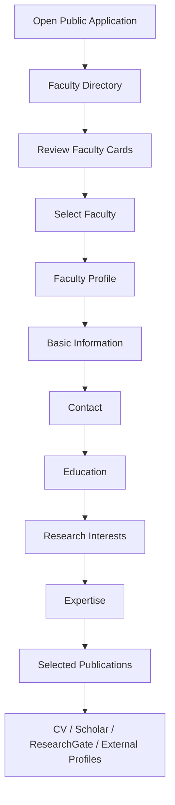

Canonical frontend routes:

```text
/faculties
/faculties/{id}
```

---

# 8. Final Technology Stack

| Layer | Final Technology | Responsibility |
|---|---|---|
| Frontend | Next.js App Router + React + TypeScript | Directory, Profile, UI states, routing |
| Styling | Tailwind CSS | Responsive UI |
| Frontend Hosting | Vercel | Production build/deployment/public URL |
| Public API | Amazon API Gateway HTTP API (v2) | HTTPS entry point, routes, methods, CORS |
| Backend | AWS Lambda / Python | Read logic, validation, response mapping |
| Storage | Amazon S3 | Controlled source, serving JSON, metadata |
| Access Control | AWS IAM | Runtime least privilege + developer access |
| Source of Truth | Department Public Faculty Website | Authoritative public source |
| Controlled Snapshot | JSON | Repeatable source capture |
| Serving Format | JSON | Runtime public-safe data |
| Database | None | Not needed for V1 |
| Authentication | None | V1 is public read-only |

---

# 9. Final High-Level Architecture

```mermaid
flowchart TB
    SRC[Department Public Faculty Website<br/>Source of Truth]

    SNAP[Controlled JSON Snapshot<br/>data/v1/source/<br/>faculty_profiles.json<br/>source-metadata.json]

    PREP[prepare_faculty_data.py<br/>Validate · Normalize · Deduplicate · Sanitize]

    subgraph AWS[AWS — ap-southeast-1]
        subgraph S3B[Private Amazon S3]
            S3SRC[source/current/<br/>Controlled Snapshot]
            S3SERV[serving/<br/>faculties.json<br/>faculties/{id}.json]
            S3META[metadata/<br/>manifest.json<br/>preparation-summary.json]
        end

        L[AWS Lambda<br/>Faculty Read Service]
        AGW[Amazon API Gateway<br/>HTTP API v2<br/>Stage: prod]
        IAM[AWS IAM<br/>Least Privilege]
    end

    subgraph FRONTEND[Frontend]
        V[Vercel]
        N[Next.js<br/>/faculties<br/>/faculties/{id}]
    end

    U[Public User<br/>No Login · Read Only]

    SRC --> SNAP
    SNAP --> PREP
    PREP --> S3SRC
    PREP --> S3SERV
    PREP --> S3META

    IAM -.controls.-> L
    S3SERV -->|s3:GetObject serving/* only| L
    L --> AGW
    AGW -->|HTTPS / JSON / GET| N
    V --- N
    N --> U
```

---

# 10. Trust / Public–Private Boundary

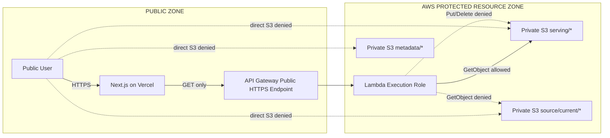

### Core security invariant

```text
Public user → S3 directly          ❌
Public user → API GET              ✅
Lambda → serving GetObject         ✅
Lambda → source GetObject          ❌
Lambda → serving PutObject         ❌
Lambda → serving DeleteObject      ❌
```

---

# 11. Component Responsibilities

| Component | Must do | Must NOT do |
|---|---|---|
| Department Public Faculty Website | Remain the authoritative public source | Be treated as runtime S3 data |
| Controlled Snapshot | Preserve a traceable machine-readable capture | Become a new Source of Truth |
| `prepare_faculty_data.py` | Validate, normalize, deduplicate, sanitize, generate output | Auto-publish failed data |
| S3 `source/current/` | Store the controlled source snapshot | Serve runtime requests |
| S3 `serving/` | Store public-safe runtime JSON | Be public directly |
| S3 `metadata/` | Store manifest/preparation evidence | Be returned as faculty API data |
| Lambda | Validate requests, read serving JSON, map safe responses | Read source, mutate S3, leak internals |
| API Gateway | Public HTTPS boundary, routes, CORS, method boundary | Expose S3 directly |
| Next.js | Render Directory/Profile and call the API | Hold AWS credentials or call private S3 |
| Vercel | Build/deploy the frontend, host the production site | Store AWS runtime credentials |
| IAM | Restrict runtime/developer permissions | Grant broad unrelated access |
| Public User | Read public information | Mutate data or access internal storage |

---

# 12. Data Architecture

## 12.1 Source of Truth decision

Final decision:

> **The department-maintained Public Faculty Website is the V1 Source of Truth.**

Reasons:

- It is public information the department already maintains.
- There is no central Excel / CSV / Google Sheet dataset for V1.
- Faculty information can be traced back to the source.
- It matches V1's role as a public information service.

## 12.2 Controlled Source Snapshot

Repository:

```text
data/
└── v1/
    └── source/
        ├── faculty_profiles.json
        └── source-metadata.json
```

Purpose:

- Repeatable preparation
- Validation
- Testing
- Traceability
- Reproducibility
- A stable source capture

V1 has no automatic scraper and no scheduled sync.

## 12.3 Live V1 dataset — 22 faculty records

The validated, deployed V1 dataset contains **22 real faculty records** captured from the
department's public faculty pages:

```text
denduang-pradubsuwun          pakorn-waewsawangwong
kasidit-chanchio               pokpong-songmuang
krittakom-srijiranon           prapaporn-rattanatamrong
lumpapun-punchoojit            saowaluk-watanapa
nawarerk-chalarak               satanat-kitsiranuwat
nuttanont-hongwarittorrn        sirikunya-nilpanich
onjira-sitthisak                songsakdi-rongviriyapanish
pakkaporn-saophan               tanatorn-tanantong
pakorn-leesutthipornchai        thapana-boonchoo
wanida-putthividhya             wilawan-rukpakavong
wirat-jareevongpiboon           worawan-marurngsith
```

`prapaporn-rattanatamrong` and `thapana-boonchoo` remain useful smoke-test references because
they represent opposite ends of data completeness (`prapaporn` has a CV, badges, and multiple
publications; `thapana` has no CV and demonstrates the missing-optional-data path).

## 12.4 Data quality decisions made during preparation

Preparing the real department content surfaced a few judgment calls. These are recorded here
so the team can explain them and, if needed, revisit them with the department:

1. **Worawan's name pair** — the supplied Thai name (`วรวรรณ ดีอัซ การ์บาโย`) and English name
   (`Worawan Marurngsith`) do not read as a literal translation of each other. Both were kept
   exactly as published by the source, since V1 does not second-guess the source's own
   identity data.
2. **Conflicting contact info** — the directory listing and the individual profile page
   sometimes show different phone/extension values for the same person. The profile-page value
   was preferred; the directory value was used only when the profile page had none.
3. **Sirikunya's academic links** — the supplied profile page linked to Saowaluk Watanapa's
   academic profiles. Those links were dropped for Sirikunya's record to avoid publishing
   another faculty member's profiles under the wrong person.
4. **One email per faculty member** — Krittakom and Thapana each had more than one published
   email address. Because the current Faculty Detail contract has a single `contact.email`
   field, one primary email was selected for each.
5. **Lumpapun's ResearchGate link** — the supplied URL points to a specific publication page on
   ResearchGate rather than a person-profile page. It was kept as supplied rather than guessed
   or corrected.
6. **Formatting noise** — a few expertise entries had stray leading characters from copy/paste
   (e.g. a leading `D` on "Software Engineering", a leading `H` on "Optimization"). These were
   normalized to the clean wording that also appears elsewhere in the same source content.
7. **Placeholder values excluded** — values such as `-`, blank sections, and literal placeholder
   text (e.g. "ใส่ผลงานตรงนี้" / "put the output here") were treated as missing optional data,
   not as real content, and were not published.

None of these are automated guesses beyond what is listed above — anything more ambiguous was
left out rather than invented.

---

# 13. Data Preparation Pipeline

Implementation:

```text
scripts/prepare_faculty_data.py
```

Command:

```bash
python scripts/prepare_faculty_data.py
```

Final pipeline:

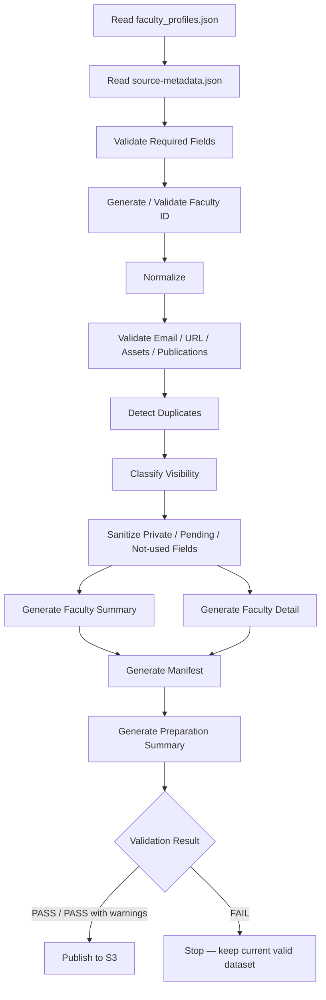

A small compatibility fix was made to the academic-title-stripping logic so titles such as
`Ajarn` and `Ajarn Dr.` (with or without extra spacing) produce clean slugs like
`nawarerk-chalarak` instead of `ajarn-drnawarerk-chalarak`. `expertise` was also added to the
`serving/faculties.json` summary output to match the frozen Faculty Summary contract. No web
scraping or scheduled synchronization was added.

---

# 14. Validation Rules

## 14.1 Required data

A faculty record must have at least:

- A Thai display name, **or**
- An English display name

and must produce a valid Faculty ID.

Missing required identity:

```text
Preparation = FAIL
New dataset = not published
```

## 14.2 Faculty ID

Requirements:

- deterministic
- stable
- unique
- URL-safe
- safe as an S3 key component
- safe as a frontend path parameter

Backend validation pattern:

```regex
^[a-z0-9]+(?:-[a-z0-9]+)*$
```

Maximum length:

```text
64 characters
```

Rejected:

```text
empty
whitespace
..
/
\
control characters
uppercase
_
.
leading/trailing hyphen
double hyphen
percent-encoded traversal patterns
```

Validation happens **before** an S3 object key is built.

## 14.3 Optional data

Examples of optional fields:

- CV
- phone
- badge
- publication
- DOI
- ResearchGate
- external academic profile
- profile image

Missing optional data:

```text
PASS WITH WARNING
```

It does not fail the whole faculty record.

## 14.4 Email / URL validation

If an optional email/URL is malformed:

- report a warning
- remove the invalid optional value from the serving output
- do not fail the whole faculty record unless the contract requires that field

---

# 15. Normalization Rules

Data preparation performs at least:

- trim whitespace
- collapse duplicated spaces
- normalize line breaks
- normalize empty values
- normalize email
- normalize Faculty ID
- normalize URLs
- normalize asset references
- remove exact-duplicate research interests
- preserve the academic meaning of expertise/research content

Key principle:

> **Normalization must not invent or change academic meaning.**

---

# 16. Duplicate Handling

## Faculty duplicate

Checked using at least:

1. Faculty ID
2. Thai name
3. English name

A Faculty ID collision:

```text
FAIL
```

to prevent a silent overwrite.

## Publication duplicate

Detection priority:

```text
DOI
 ↓
Stable Publication ID
 ↓
Normalized title / citation
```

If it's unclear whether two entries are the same publication:

```text
Flag for review
```

Never delete based on a guess.

---

# 17. Sanitization / Public Data Selection

Classification:

```text
PUBLIC                → KEEP
PRIVATE               → REMOVE
PENDING_CONFIRMATION  → REMOVE
NOT_USED_IN_V1        → REMOVE
```

The serving JSON must never contain:

- workload data
- student information
- internal review notes
- approval information
- internal notes
- AWS credentials
- secrets
- internal source paths
- private project configuration

---

# 18. Missing Data Convention

Missing scalar / object:

```json
null
```

Missing list:

```json
[]
```

Example:

```json
{
  "cv": null,
  "expertise": [],
  "selected_publications": []
}
```

The frontend must never render a raw `null` / `undefined`.

---

# 19. Faculty Summary Contract

Used by:

```http
GET /api/v1/faculties
```

Concept:

```json
{
  "id": "prapaporn-rattanatamrong",
  "name": {
    "th": "ผศ.ดร.ประภาพร รัตนธำรง",
    "en": "Asst.Prof.Dr. Prapaporn Rattanatamrong"
  },
  "academic_position": "ผู้ช่วยศาสตราจารย์",
  "profile_image": {
    "url": "https://...",
    "alt": "ผศ.ดร.ประภาพร รัตนธำรง"
  },
  "research_interests": [],
  "expertise": []
}
```

The Directory must not fetch every faculty member's detail JSON just to build the list.

---

# 20. Faculty Detail Contract

Used by:

```http
GET /api/v1/faculties/{id}
```

Concept:

```text
Faculty
│
├── id
├── name
│   ├── th
│   └── en
├── academic_position
├── profile_image
├── badges[]
├── cv
├── contact
│   ├── office
│   ├── phone
│   └── email
├── education[]
├── research_interests[]
├── expertise[]
├── selected_publications[]
└── publication_profiles[]
```

The frontend renders only what the API actually sends. It must never hard-code an external
academic provider that isn't in the source data.

---

# 21. S3 Logical Structure — Final

Bucket:

```text
cs361-v1-faculty-data-g1-334177992720-ap-southeast-1-an
```

Region:

```text
ap-southeast-1
```

Structure:

```text
bucket/
│
├── source/
│   └── current/
│       ├── faculty_profiles.json
│       └── source-metadata.json
│
├── serving/
│   ├── faculties.json
│   └── faculties/
│       ├── denduang-pradubsuwun.json
│       ├── kasidit-chanchio.json
│       ├── ... (22 files total)
│       └── worawan-marurngsith.json
│
└── metadata/
    ├── manifest.json
    └── preparation-summary.json
```

Meaning:

| Prefix | Meaning | Runtime Lambda Read? | Public Direct Access? |
|---|---|---:|---:|
| `source/current/` | Controlled snapshot / traceability | No | No |
| `serving/` | Public-safe runtime JSON | Yes | No |
| `metadata/` | Manifest/preparation evidence | No | No |

---

# 22. Dataset Manifest / Preparation Summary

Generated:

```text
build/v1/metadata/manifest.json
build/v1/metadata/preparation-summary.json
```

S3:

```text
metadata/manifest.json
metadata/preparation-summary.json
```

Latest validated preparation run against the real 22-faculty dataset, reproduced locally from
`data/v1/source/` and recorded in `build/v1/metadata/preparation-summary.json`:

```text
Faculty Records: 22
Valid Faculty: 22
Invalid Faculty: 0
Selected Publications: 7
Warnings: 12
Errors: 0

Status: PASSED_WITH_WARNINGS
```

All 12 warnings are the same kind — an optional CV link is missing for that faculty member
(`kasidit-chanchio`, `nuttanont-hongwarittorrn`, `songsakdi-rongviriyapanish`,
`tanatorn-tanantong`, `saowaluk-watanapa`, `wanida-putthividhya`, `sirikunya-nilpanich`,
`lumpapun-punchoojit`, `thapana-boonchoo`, `nawarerk-chalarak`, `satanat-kitsiranuwat`,
`pakkaporn-saophan`). This demonstrates that missing optional data is handled without breaking
the dataset or blocking publication.

---

# 23. Safe Publish Strategy

V1 uses:

> **Generate locally → Validate → Publish only after PASS**

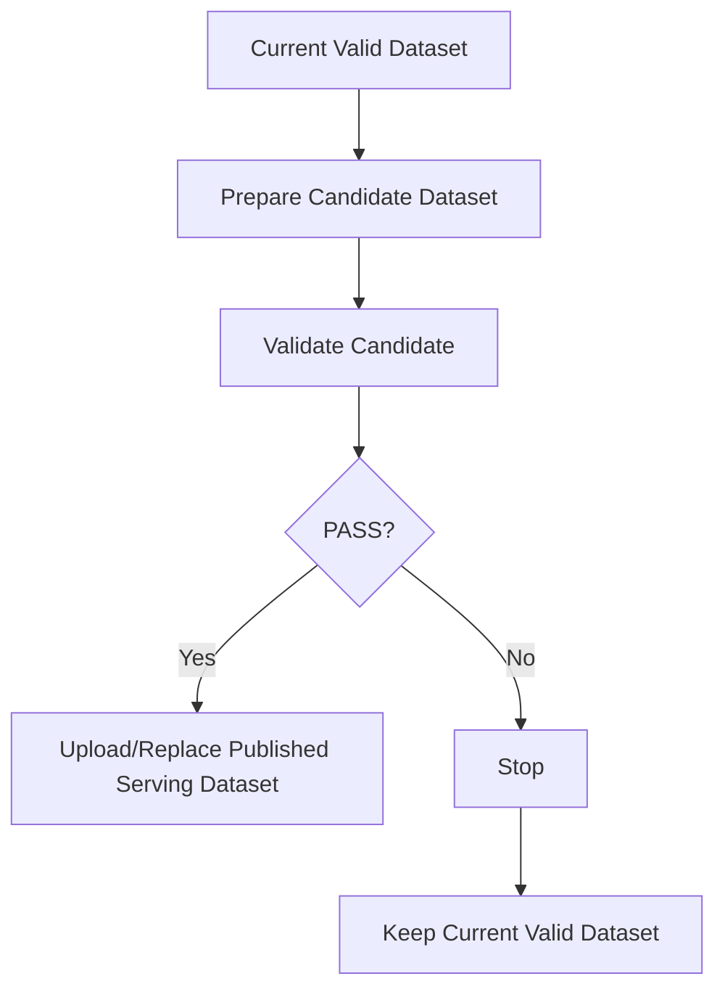

A failed preparation run must not:

- publish partial output
- overwrite the current valid serving dataset
- delete current valid data

---

# 24. Runtime Request Flow

## 24.1 Faculty Directory

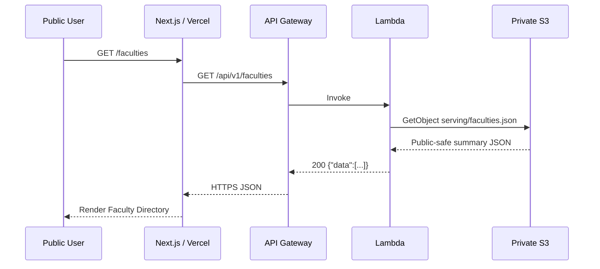

## 24.2 Faculty Profile

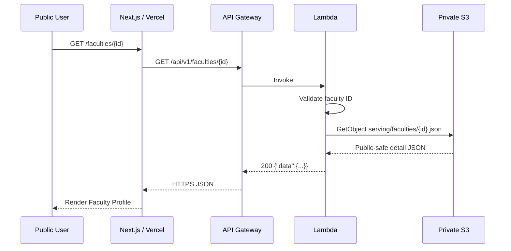

---

# 25. Final Public API Contract

## 25.1 Faculty List

```http
GET /api/v1/faculties
```

Success:

```json
{
  "data": []
}
```

## 25.2 Faculty Detail

```http
GET /api/v1/faculties/{id}
```

Success:

```json
{
  "data": {}
}
```

## 25.3 Health endpoint

The final backend only defines the List and Detail routes as the required V1 public contract.

> **Do not claim `GET /health` as implemented unless the deployed API actually has it.**

Health is **not required and not counted** as a V1 acceptance dependency in this document.

---

# 26. API Error Contract

```json
{
  "error": {
    "code": "FACULTY_NOT_FOUND",
    "message": "Faculty not found."
  }
}
```

Documented backend behavior:

| HTTP | Example error code | Meaning |
|---:|---|---|
| `200` | — | Success |
| `400` | `INVALID_FACULTY_ID` | Invalid Faculty ID |
| `404` | `FACULTY_NOT_FOUND` | Detail not found |
| `404` | `ROUTE_NOT_FOUND` | Path not supported |
| `405` | `METHOD_NOT_ALLOWED` | Method is not GET |
| `500` | `INTERNAL_ERROR` | Safe backend/S3/JSON failure |

A public error must never expose:

- a traceback
- unnecessary bucket details
- a raw S3 key
- a raw AWS exception
- account details
- credentials
- environment variables
- private source data

---

# 27. API Gateway — Final

Type:

```text
Amazon API Gateway HTTP API (v2)
```

API:

```text
cs361-v1-http-api
```

API ID:

```text
tso165yhp7
```

Stage:

```text
prod
```

Deployment:

```text
Auto-deploy enabled
```

Required routes:

```http
GET /api/v1/faculties
GET /api/v1/faculties/{id}
```

Expected base URL, from the deployed API ID, region, and stage:

```text
https://tso165yhp7.execute-api.ap-southeast-1.amazonaws.com/prod
```

> Before final submission, copy the **Invoke URL from API Gateway → Stages → prod** and compare
> it against this document to catch any typo.

---

# 28. Public Read-only Boundary

Allowed business operation:

```text
GET     ✅
```

CORS preflight:

```text
OPTIONS ✅
```

Business mutation:

```text
POST    ❌
PUT     ❌
PATCH   ❌
DELETE  ❌
```

Defense-in-depth:

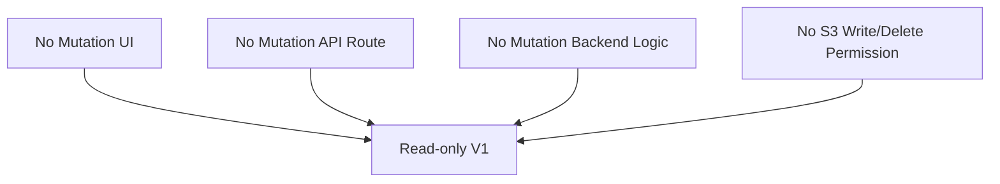

---

# 29. CORS Decision

Final CORS principle:

- allow the local development origin
- allow the exact Vercel production origin
- do not use a broad `*` as the final allowlist
- allow only the required methods
- credentials are not required

Target final configuration:

```text
Allowed Origins
- http://localhost:3000
- https://<FINAL-VERCEL-PRODUCTION-DOMAIN>.vercel.app
  OR the exact custom production domain

Allowed Methods
- GET
- OPTIONS

Allowed Headers
- content-type

Allow Credentials
- false
```

**Final documentation requirement:** replace
`https://<FINAL-VERCEL-PRODUCTION-DOMAIN>.vercel.app` with the exact final origin Vercel uses,
and capture the final API Gateway CORS screen as evidence.

---

# 30. IAM / Least Privilege

## 30.1 Lambda runtime role

```text
CS361V1LambdaExecutionRole
```

Required policies:

```text
AWSLambdaBasicExecutionRole
CS361V1LambdaServingReadPolicy
```

## 30.2 S3 serving read policy

Allowed action:

```text
s3:GetObject
```

Allowed resource:

```text
arn:aws:s3:::cs361-v1-faculty-data-g1-334177992720-ap-southeast-1-an/serving/*
```

Must not allow:

```text
source/*
metadata/*
s3:PutObject
s3:DeleteObject
s3:*
```

## 30.3 Human developer access

Group:

```text
CS361V1Developers
```

Policy:

```text
CS361V1DeveloperPolicy
```

Intended project-scoped permissions:

- manage required project S3 objects/prefixes
- manage project Lambda resources
- manage project API Gateway resources in the selected region
- read CloudWatch Logs as needed
- `iam:PassRole` only for `CS361V1LambdaExecutionRole` to Lambda

Must not rely on:

```text
AdministratorAccess
IAMFullAccess
AmazonS3FullAccess
PowerUserAccess
```

---

# 31. Actor–Resource–Permission Matrix

| Actor | Resource | Required Action | Explicitly Not Required / Must Not Be Allowed | Mechanism |
|---|---|---|---|---|
| Public User | Next.js/Vercel | Read pages | Modify application/data | Public HTTPS |
| Public User | API Gateway | `GET` | POST/PUT/PATCH/DELETE mutation | HTTP API route boundary |
| Public User | S3 source | None | Direct read/write | Block Public Access |
| Public User | S3 serving | None directly | Direct read/write | Block Public Access |
| Public User | S3 metadata | None | Direct read/write | Block Public Access |
| Lambda | S3 serving | `GetObject` | Put/Delete | IAM runtime role |
| Lambda | S3 source | None | Read/write | Not granted |
| Lambda | S3 metadata | None | Read/write unless explicitly required | Not granted |
| Lambda | CloudWatch Logs | Write logs | Read unrelated project data | Basic execution role |
| Project Team | Project resources | Required management operations | Broad unrelated AWS admin | Developer group/policy |
| Vercel frontend | API Gateway | Public GET request | AWS IAM/S3 credential use | `NEXT_PUBLIC_API_BASE_URL` |

---

# 32. S3 Security

Final S3 boundary:

```text
Block Public Access = Enabled
```

Expected:

```text
Public → source/current/*   = AccessDenied
Public → serving/*          = AccessDenied
Public → metadata/*         = AccessDenied
```

Runtime path is:

```text
Browser
  ↓
Next.js / Vercel
  ↓
API Gateway
  ↓
Lambda
  ↓
Private S3 serving/*
```

The frontend never receives AWS credentials.

---

# 33. Required Security Negative Tests

| Test | Expected |
|---|---|
| Public GET source object URL | Denied |
| Public GET serving object URL | Denied |
| Lambda Get `serving/faculties.json` | Allowed |
| Lambda Get `source/current/faculty_profiles.json` | Denied |
| Lambda Put `serving/test.json` | Denied |
| Lambda Delete `serving/faculties.json` | Denied |
| POST API | 404/405, no mutation |
| PUT API | 404/405, no mutation |
| PATCH API | 404/405, no mutation |
| DELETE API | 404/405, no mutation |
| Invalid faculty ID | 400 safe error |
| Unknown faculty | 404 safe error |
| Backend/S3 unexpected error | 500 safe error |
| Error body inspection | No stack trace / credential / raw S3 path |

---

# 34. Secret Management

## Frontend

Allowed public configuration:

```text
NEXT_PUBLIC_API_BASE_URL
```

Must not contain:

- AWS Access Key
- AWS Secret Access Key
- IAM user credentials
- private S3 credentials
- internal source data

## Lambda

Configuration:

```text
DATA_BUCKET_NAME
SERVING_PREFIX
LOG_LEVEL
ENVIRONMENT
```

Expected production values:

```text
DATA_BUCKET_NAME=cs361-v1-faculty-data-g1-334177992720-ap-southeast-1-an
SERVING_PREFIX=serving
LOG_LEVEL=INFO
ENVIRONMENT=prod
```

Never put an AWS Access Key / Secret Key in Lambda environment variables. Lambda uses its
execution role's credentials automatically.

---

# 35. Logging Boundary

Safe logs may contain:

- the request route/method
- the validated Faculty ID
- success/failure
- the internal error type
- operational diagnostics

Must never log:

- AWS credentials
- secrets
- the raw private/source dataset
- unnecessary complete faculty records
- sensitive internal configuration

The public API error response and internal CloudWatch logging are separate concerns.

---

# 36. Actual Repository Structure — V1

```text
CS361-v1-Group-1/
│
├── build/
│   └── v1/                         # generated — not the source of truth
│
├── data/
│   └── v1/
│       └── source/                 # controlled snapshot (22 faculty records)
│
├── docs/
│   └── v1/                         # this document + historical drafts
│
├── fixtures/
│   └── v1/                         # synthetic fixtures for backend unit tests
│
├── frontend/
│   ├── app/
│   │   └── faculties/
│   │       ├── page.tsx
│   │       ├── loading.tsx
│   │       ├── error.tsx
│   │       └── [id]/
│   ├── components/
│   ├── lib/
│   │   └── faculty-api.ts
│   ├── public/
│   ├── types/
│   └── .env.example
│
├── function_faculties/
│   ├── infra/
│   │   └── lambda-s3-readonly-policy.json
│   ├── lambda/
│   │   ├── faculty_service.py
│   │   ├── handler.py
│   │   ├── responses.py
│   │   ├── s3_repository.py
│   │   └── validation.py
│   ├── script/
│   └── tests/
│
├── scripts/
│   └── prepare_faculty_data.py
│
└── README.md
```

> Final documentation uses `function_faculties/` because that is the actual repository
> structure — not an older generic `backend/` example.
>
> An `evidence/` folder (screenshots, API responses, security test results — see §49) is
> planned for closing #29 but has not been created in the repository yet.

---

# 37. Frontend Implementation Notes

Current frontend stack:

```text
Next.js App Router
React
TypeScript
Tailwind CSS
npm
```

Local requirements:

```text
Node.js >= 20.9
```

Frontend routes:

```text
/faculties
/faculties/{id}
```

API client:

```text
frontend/lib/faculty-api.ts
```

Boundary: the API client is the single logical place that uses `NEXT_PUBLIC_API_BASE_URL`; the
frontend must never call private S3 directly.

The frontend also ships `@vercel/analytics` and `@vercel/speed-insights`, wired into
`frontend/app/layout.tsx`, for basic visitor and page-performance telemetry on the production
deployment. Neither package touches faculty data or the AWS backend.

---

# 38. Local Development Setup

## 38.1 Prerequisites

- Git
- Python 3
- Node.js `>=20.9`
- npm
- AWS CLI, only if performing AWS operations locally
- AWS credentials, only for authorized project developers, never committed

## 38.2 Clone

```bash
git clone https://github.com/suphanatchanlek30/CS361-v1-Group-1.git
cd CS361-v1-Group-1
```

## 38.3 Prepare V1 data

The source snapshot must exist at:

```text
data/v1/source/faculty_profiles.json
data/v1/source/source-metadata.json
```

Run:

```bash
python scripts/prepare_faculty_data.py
```

Expected generated paths:

```text
build/v1/serving/faculties.json
build/v1/serving/faculties/{id}.json
build/v1/metadata/manifest.json
build/v1/metadata/preparation-summary.json
```

If preparation fails, **do not** upload the candidate output to S3.

## 38.4 Frontend environment

```bash
cd frontend
npm install
cp .env.example .env.local
```

Set:

```env
NEXT_PUBLIC_API_BASE_URL=https://tso165yhp7.execute-api.ap-southeast-1.amazonaws.com/prod
```

Never put AWS credentials in `.env.local`.

## 38.5 Run the frontend

```bash
npm run dev
```

Local URL:

```text
http://localhost:3000
```

Verify:

```text
http://localhost:3000/faculties
http://localhost:3000/faculties/{existing-id}
```

## 38.6 Frontend quality commands

```bash
npm run lint
npm run build
```

Production-like local run, after a successful build:

```bash
npm run start
```

## 38.7 Backend tests

```bash
cd function_faculties
python -m pytest tests/
```

---

# 39. Backend Runtime Workflow

Backend code:

```text
function_faculties/lambda/
```

Conceptual flow:

```text
API Gateway event
     ↓
handler.py
     ↓
route/method validation
     ↓
Faculty ID validation
     ↓
faculty_service.py
     ↓
s3_repository.py
     ↓
GetObject serving/*
     ↓
responses.py
```

The Lambda handler must:

- support list
- support detail
- reject unsupported methods
- reject an invalid ID before touching S3
- return a safe error envelope
- never write/delete S3

---

# 40. AWS Deployment Notes

## 40.1 Data

1. Run preparation locally.
2. Confirm validation is PASS / PASS_WITH_WARNINGS.
3. Upload the controlled snapshot to `source/current/`.
4. Upload the generated public-safe runtime objects to `serving/`.
5. Upload the generated metadata to `metadata/`.
6. Verify S3 Block Public Access is still enabled.

## 40.2 Lambda

Verify:

```text
Region: ap-southeast-1
Role: CS361V1LambdaExecutionRole
```

Required environment variables:

```text
DATA_BUCKET_NAME
SERVING_PREFIX
LOG_LEVEL
ENVIRONMENT
```

Required runtime permission:

```text
s3:GetObject serving/*
```

No source/write/delete permission.

## 40.3 API Gateway

Verify HTTP API routes:

```http
GET /api/v1/faculties
GET /api/v1/faculties/{id}
```

Verify:

```text
Stage: prod
Auto-deploy: enabled
```

While auto-deploy stays enabled, API Gateway configuration changes on the `prod` stage deploy
automatically.

---

# 41. Vercel Deployment

Recommended final project configuration:

```text
Repository: CS361-v1-Group-1
Root Directory: frontend
Framework: Next.js
```

Production environment variable:

```text
NEXT_PUBLIC_API_BASE_URL=https://tso165yhp7.execute-api.ap-southeast-1.amazonaws.com/prod
```

Deployment checks:

- production build passes
- `/faculties` works
- `/faculties/{id}` works
- a direct refresh of the dynamic route works
- the real API is used
- no hard-coded production faculty data
- no direct S3 dependency
- the production origin is in API Gateway CORS

---

# 42. Final URLs

## API

```text
https://tso165yhp7.execute-api.ap-southeast-1.amazonaws.com/prod
```

Faculty List:

```text
https://tso165yhp7.execute-api.ap-southeast-1.amazonaws.com/prod/api/v1/faculties
```

## Frontend Demo

**REQUIRED FINAL FILL-IN:**

```text
<PASTE_FINAL_VERCEL_PRODUCTION_URL_HERE>
```

After pasting, also update the CORS documentation to the exact same origin. Do not invent a
Vercel URL — leave this blank until the real production URL is known.

---

# 43. Deployment Flow Diagram

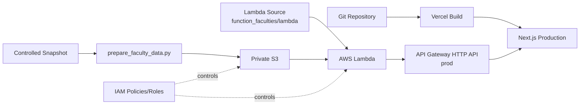

---

# 44. Source vs Serving Boundary

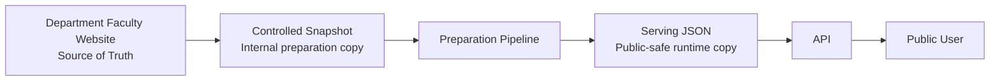

Key rule:

```text
Source of Truth ≠ Controlled Snapshot ≠ Serving Dataset
```

---

# 45. Public vs Private Data Boundary

## Public-safe concepts

```text
Faculty Name
Academic Position
Public Contact
Education
Research Interests
Expertise
Selected Publications
Public Faculty Image
Public CV
Public Academic Profiles
```

## Internal / not for public runtime

```text
Controlled Source Snapshot
Internal Notes
Workload
Student Information
Review Information
Approval Information
Private Source Paths
AWS Credentials
Internal Configuration
Preparation-only Metadata
```

---

# 46. Architecture Decisions

## ADR-01 — Use Next.js

**Decision:** Use Next.js as the frontend framework.

**Reasons:** component-based; supports the Directory and dynamic Profile route; supports the
App Router structure; a mature responsive-web ecosystem; can evolve into future versions.

**Trade-offs:** more framework complexity than static HTML; build/runtime configuration
required.

**Status:** Accepted / Implemented in V1.

## ADR-02 — Deploy the frontend on Vercel

**Decision:** Use Vercel for Next.js production deployment.

**Reasons:** simple Next.js deployment; a fast team workflow; preview/production workflow; low
frontend infrastructure overhead.

**Trade-offs:** a multi-provider architecture; CORS must be configured between Vercel and AWS;
deployment configuration lives on two platforms.

**Status:** Accepted / Implemented in V1.

## ADR-03 — Use Amazon API Gateway HTTP API

**Decision:** Use API Gateway HTTP API v2 as the public backend boundary.

**Reasons:** an HTTPS public endpoint; separates the frontend from private storage; route/method
control; CORS support; the API boundary can stay stable even if the V2 data layer changes.

**Trade-offs:** an extra AWS component; CORS and route integration must be managed.

**Status:** Accepted / Implemented in V1.

## ADR-04 — Use AWS Lambda

**Decision:** Use Lambda for Faculty read logic.

**Reasons:** V1's backend operations are small — list faculty, detail faculty, validate ID, read
S3, map safe errors. No dedicated server is required.

**Trade-offs:** possible cold starts; local debugging differs from a long-running server; IAM
must be configured carefully.

**Status:** Accepted / Implemented in V1.

## ADR-05 — Use Amazon S3

**Decision:** Use S3 for the controlled snapshot, serving JSON, and preparation metadata.

**Reasons:** V1 is read-heavy/read-only; a simple JSON object model; low operational overhead; a
clear source/serving prefix boundary; integrates directly with Lambda.

**Trade-offs:** not suited to complex relational queries; not ideal for frequent transactional
updates; advanced filtering/aggregation is limited.

**Status:** Accepted / Implemented in V1.

## ADR-06 — IAM least privilege

**Decision:** Lambda gets only the read permission it needs, on `serving/*`.

**Reasons:** minimizes blast radius; prevents accidental mutation; enforces the source/serving
boundary; easy to prove with negative tests.

**Trade-offs:** more detailed policy design; misconfiguration can break the integration.

**Status:** Accepted / Implemented in V1.

## ADR-07 — No database in V1

**Decision:** Do not add a database.

**Reasons:** V1 has no create, update, delete, transaction, multi-user write workflow, or
managed-repository requirement. Serving JSON is enough.

**Trade-offs:** complex queries are limited; frequent updates/search/aggregation in the future
may need structured persistence.

**Status:** Accepted / intentional V1 boundary.

## ADR-08 — No authentication in V1

**Decision:** No login/authentication for V1's public pages.

**Reasons:** V1's requirement is public information access; there is no private user workspace
or mutation operation.

**Trade-offs:** cannot support faculty self-service or restricted internal data; a future secure
workspace version will need authentication/authorization.

**Status:** Accepted / intentional V1 boundary.

## ADR-09 — Controlled JSON snapshot instead of automatic scraping

**Decision:** Capture source website information into a controlled JSON snapshot and prepare it
explicitly.

**Reasons:** repeatable; testable; reviewable; traceable; avoids accidental automatic
publication; the source changes infrequently for V1's timeline.

**Trade-offs:** manual source refresh; the source can go stale until the snapshot is updated;
requires discipline in recording capture metadata.

**Status:** Accepted / Implemented in V1.

## ADR-10 — S3 JSON vs database

**S3 JSON strengths:** simple; low cost/operations; appropriate for read-only V1; easy to
version and inspect; no schema migration service required.

**S3 JSON limitations:** complex queries are hard; frequent write/update is awkward; no
transactions; cross-year aggregation/search does not scale naturally.

**Decision:** Use S3 JSON for V1 and revisit a persistent structured repository in V2, based on
real query/update requirements.

## ADR-11 — Vercel + AWS multi-provider

**Benefits:** frontend deployment optimized for Next.js; the AWS backend stays focused on
data/API/security; fast implementation.

**Costs:** two provider consoles; environment values must stay aligned; CORS is required;
deployment evidence comes from two platforms.

**Decision:** Accepted for V1's timeline and scope.

---

# 47. Known Limitations

```text
No login
No database
No faculty editing
No admin portal
No workload management
No approval workflow
No reporting
No automatic synchronization
No scheduled scraper
No advanced aggregation
```

These are V1 boundaries.

---

# 48. V1 → V2 Direction

The course roadmap calls for V2 to become a more systematic Faculty Output Repository
supporting multiple kinds of output across multiple academic years.

V1:

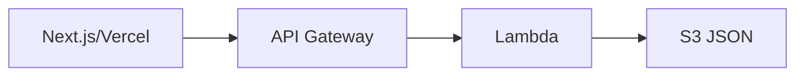

Possible V2 evolution:

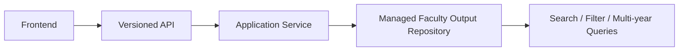

V2 may introduce a database or other structured storage **only if V2's requirements justify
it**.

Expected V2 capability direction:

- teaching records
- research outputs
- services
- student supervision
- multiple academic years
- systematic search/filter
- a structured repository

Authentication belongs to a later secure-workspace requirement — it does not automatically
belong to V2 unless the team's version plan says so.

---

# 49. Evidence Package Structure

Not created yet — planned for closer to the final demo, once there are real screenshots and a
live URL to attach. When it's created, use this layout:

```text
evidence/
├── architecture/
├── data/
├── aws/
├── api/
├── frontend/
├── security/
└── e2e/
```

The folder name doesn't have to match exactly, but evidence should be easy to find by category.

---

# 50. Evidence Naming Convention

Use clear, numbered filenames, for example:

```text
evidence/architecture/01-final-v1-architecture.png
evidence/data/01-source-snapshot-example.png
evidence/aws/01-s3-prefix-structure.png
evidence/api/01-list-200.png
evidence/frontend/01-directory-desktop.png
evidence/security/01-public-source-access-denied.png
evidence/e2e/01-vercel-production-url.png
```

Once the folder exists, its own README should track what's collected versus still pending.

---

# 51. Minimum Evidence to Close #29

Must be easy to find:

- Final architecture diagram
- Responsibility table
- Controlled source snapshot example
- Serving JSON
- Preparation result
- Manifest
- S3 structure
- S3 Block Public Access
- Lambda function/config
- Lambda role/policies
- API Gateway routes
- API Gateway `prod` stage
- Faculty List response
- Faculty Detail response
- Unknown Faculty response
- Unsupported method response
- CORS local
- CORS Vercel production
- Direct S3 AccessDenied
- Lambda serving allowed
- Lambda source denied
- Lambda put denied
- Lambda delete denied
- Directory desktop/mobile
- Profile desktop/mobile
- 404/not-found state
- API error state
- Snapshot → Serving → API → UI comparison
- Vercel URL
- API URL
- E2E result
- bug/retest result
- team approval

---

# 52. Demo Story

```text
1. Course Requirement
        ↓
2. V1 Scope / Boundary
        ↓
3. Source of Truth Decision
        ↓
4. Controlled Snapshot / Preparation
        ↓
5. Final Architecture
        ↓
6. Private S3
        ↓
7. Lambda
        ↓
8. API Gateway
        ↓
9. Directory
        ↓
10. Profile
        ↓
11. Security / Least Privilege
        ↓
12. E2E Evidence
        ↓
13. Trade-offs
        ↓
14. V1 → V2
```

---

# 53. Live Demo Checklist

1. Open the Vercel production URL
2. Open `/faculties`
3. Confirm the Directory loads from the real API
4. Select a faculty member
5. Show the profile
6. Show Contact
7. Show Education
8. Show Research Interests
9. Show Expertise
10. Show Publications
11. Show CV / external profiles, if present
12. Go back and open a second faculty member
13. Show that missing optional data is handled safely
14. Open the list API in a browser/curl
15. Open the detail API
16. Show the unknown-faculty response
17. Show the S3 structure
18. Show S3 Block Public Access
19. Show the Lambda role
20. Show the serving read policy
21. Show source read denial
22. Show write/delete denial
23. Show the unsupported-method response
24. Show the architecture diagram
25. Explain no DB / no auth
26. Explain V1 → V2

---

# 54. Demo Backup Plan

Do not depend only on live services. Prepare:

- desktop screenshots
- mobile screenshots
- API response screenshots
- S3 security screenshots
- IAM screenshots
- the architecture diagram
- an optional short screen recording
- the final E2E summary

---

# 55. E2E Data Verification Matrix

Use at least 2 faculty members.

| Field | Snapshot | Serving | API | UI | Expected |
|---|---|---|---|---|---|
| Faculty ID | Verify | Verify | Verify | URL/render | Same |
| Thai name | Verify | Verify | Verify | Verify | Same |
| English name | Verify | Verify | Verify | Verify | Same |
| Position | Verify | Verify | Verify | Verify | Same |
| Image | Verify | Verify | Verify | Verify | Same public asset |
| Contact | Verify | Verify | Verify | Verify | Same |
| Education | Verify | Verify | Verify | Verify | Same meaning |
| Research interests | Verify | Verify | Verify | Verify | Same meaning |
| Expertise | Verify | Verify | Verify | Verify | Same meaning |
| Publications | Verify | Verify | Verify | Verify | Same faculty only |
| CV | Verify optional | Verify | Verify | Verify | Safe missing handling |
| External profiles | Verify | Verify | Verify | Verify | Public only |

Critical assertion:

> **No data from one faculty member may appear in another faculty member's detail.**

---

# 56. UI / UX Smoke Matrix

| Area | Test |
|---|---|
| Loading | Loading state renders |
| Empty | Empty list state is safe |
| API Error | User-friendly error |
| Not Found | Unknown faculty has a proper not-found state |
| Missing Optional | No raw null/undefined |
| Desktop | No critical overflow |
| Tablet | Layout readable |
| Mobile | Layout readable |
| Long name | Does not break card/profile |
| Long publication | Does not overflow |
| Keyboard | Core links reachable |
| Focus | Visible focus |
| Image alt | Present |
| External link | Safe semantic link |

---

# 57. Final Documentation Tasks Coverage

Legend: `[x]` covered by this document · `[~]` implementation complete, evidence artifact still
needs attaching · `[ ]` needs a human/team action.

## Project / Scope
- [x] Project overview · V1 requirement · Goal · In/out scope · Actors · User journey · Known limitations

## Architecture
- [x] Final diagram · Component responsibilities · Runtime flow · Data preparation flow ·
  Deployment flow · Public/private boundary · Source/serving boundary

## Data
- [x] Source of Truth · Controlled snapshot · S3 structure · Contracts · Validation/normalization
  · Duplicate/missing rules · Manifest/preparation summary (now reflecting the real 22-faculty
  run)

## API
- [x] List route · Detail route · Health decision (not claimed) · Success/error · HTTP status ·
  Read-only boundary

## Security
- [x] Permission matrix · Lambda role/policies · Developer group/policy · S3 public boundary ·
  IAM negative-test specification · CORS decision · Secret management
- [~] Attach final IAM negative-test screenshots/results
- [~] Attach the final Vercel CORS screenshot

## Setup / Deployment
- [x] Repo structure · Local setup · Environment variables · Data preparation command · Frontend
  run command · Lambda/API deployment notes · Vercel deployment procedure · API URL
- [ ] Paste the exact final Vercel demo URL

## Decisions
- [x] All eleven ADRs, trade-offs, and V1 → V2 direction

## Evidence / Demo
- [x] Real data evidence exists in-repo (`data/v1/source/`, `build/v1/`) and is documented in
  §12.3–§12.4 and §22; the manifest/preparation-summary numbers above are reproduced from a real
  local run, not invented
- [ ] `evidence/` package — not created yet (see §49)
- [ ] Architecture / AWS / API / frontend / security / E2E screenshots — still need capturing
  from the live deployment
- [ ] Final rehearsal and team sign-off

---

# 58. Acceptance Criteria Coverage Matrix

| Acceptance Criterion | Status |
|---|---|
| Docs match deployed implementation | ✅ |
| No old Excel/CSV source assumption remains as final architecture | ✅ Corrected, see §1 |
| No unimplemented feature claimed | ✅ |
| Final diagram matches system | ✅ |
| Data/API/security/deployment documented | ✅ |
| No credentials/secrets in docs | ✅ |
| Setup instructions are reproducible | ✅ Verified — regenerating `build/v1/` from the real
  snapshot reproduces byte-identical output (aside from the timestamp) |
| Demo URL/API URL recorded | ⚠️ API URL recorded; Vercel demo URL still pending |
| Evidence package complete | ⚠️ Structure and data evidence complete; AWS/API/frontend/security/E2E screenshots pending |
| Team can explain trade-offs and V1→V2 | ✅ §46–48 |
| Final review passes | ⚠️ Pending team sign-off, §60 |

---

# 59. Final Release / Demo Evidence Summary Template

Fill this in before closing #29.

## URLs

```text
Vercel Production:
<PASTE_FINAL_VERCEL_PRODUCTION_URL_HERE>

API Gateway:
https://tso165yhp7.execute-api.ap-southeast-1.amazonaws.com/prod
```

## E2E

```text
Directory: PASS / FAIL
Profile Faculty 1: PASS / FAIL
Profile Faculty 2: PASS / FAIL
Direct refresh: PASS / FAIL
Missing optional data: PASS / FAIL
Unknown Faculty: PASS / FAIL
Invalid Faculty ID: PASS / FAIL
Mobile: PASS / FAIL
```

## Security

```text
S3 Block Public Access: PASS / FAIL
Public source denied: PASS / FAIL
Public serving denied: PASS / FAIL
Lambda serving GetObject: PASS / FAIL
Lambda source GetObject denied: PASS / FAIL
Lambda PutObject denied: PASS / FAIL
Lambda DeleteObject denied: PASS / FAIL
POST/PUT/PATCH/DELETE no mutation: PASS / FAIL
Safe public errors: PASS / FAIL
CORS localhost: PASS / FAIL
CORS Vercel: PASS / FAIL
```

## Data integrity

```text
Snapshot → Serving: PASS / FAIL
Serving → API: PASS / FAIL
API → UI: PASS / FAIL
Summary/detail consistency: PASS / FAIL
No cross-faculty data: PASS / FAIL
Public-safe fields only: PASS / FAIL
```

## Critical bugs

```text
Open critical bugs: 0 / <number>
Retest complete: YES / NO
```

---

# 60. Final Team Review / Approval

```text
Tech Lead: ____________________   Date: __________
Data Owner: ___________________   Date: __________
Backend Owner: ________________   Date: __________
Frontend Owner: _______________   Date: __________
Cloud/AWS Owner: ______________   Date: __________
QA/Integration: _______________   Date: __________
```

Or use a GitHub Issue/PR approval as evidence:

```text
Issue/PR link:
____________________________________________
```

Final status once all evidence is attached:

```text
✅ V1 FINAL DOCUMENTATION APPROVED
✅ V1 DEMO EVIDENCE COMPLETE
✅ ISSUE #29 READY TO CLOSE
```

---

# 61. Evidence to Close #29 — Final Checklist

- [x] Updated canonical technical documentation (this file)
- [x] V1 requirement / scope
- [x] Final architecture diagram source (Mermaid)
- [x] Component responsibility table
- [x] Runtime data flow
- [x] Data preparation flow
- [x] S3 structure
- [x] Source-to-serving boundary / mapping concept
- [x] Faculty data contract
- [x] API documentation
- [x] Actor–resource–permission matrix
- [x] IAM role/policy documentation
- [x] S3 security documentation
- [x] Deployment/setup notes
- [x] Architecture decisions
- [x] Trade-off notes
- [x] Known limitations
- [x] V1 → V2 evolution notes
- [x] Demo checklist
- [x] Real 22-faculty dataset committed and reproducible from `scripts/prepare_faculty_data.py`
- [x] Data-quality review notes documented (§12.4 of this document)
- [ ] Paste the Vercel production URL
- [ ] Attach final API response evidence
- [ ] Attach Lambda/S3/IAM screenshots
- [ ] Attach desktop/mobile screenshots
- [ ] Attach AccessDenied / negative security evidence
- [ ] Attach the final E2E result
- [ ] Attach the bug/retest result
- [ ] Attach team approval

---

# 62. Final Definition of Done

Issue #29 is ready to close when:

1. This canonical documentation is committed under `docs/v1/`. ✅
2. The root README points to this document. ✅
3. Old source wording (`CSV/Excel/files` as V1 Source of Truth) is removed or clearly marked
   obsolete in the older draft docs. ✅ (superseded-by banners added)
4. The exact Vercel production URL is inserted. ⚠️ Pending
5. The API base URL is verified against the API Gateway `prod` Invoke URL. ⚠️ Pending manual check
6. The exact Vercel production origin is present in the final CORS config. ⚠️ Pending
7. Evidence files are organized under the evidence package. ✅ Structure + real data evidence in place; screenshots pending
8. No credentials or secrets are committed. ✅
9. The team reviews the final architecture and trade-offs. ⚠️ Pending
10. The #28 E2E result is linked/attached. ⚠️ Pending
11. No critical bug remains. ⚠️ Pending confirmation
12. Team approval is recorded. ⚠️ Pending

---

# 63. One-minute Architecture Explanation for Demo

> V1 is a public read-only faculty information service. The authoritative source is the
> Department Public Faculty Website. Because there is no central machine-readable dataset, we
> capture an approved controlled JSON snapshot and run `prepare_faculty_data.py` to validate,
> normalize, deduplicate, sanitize, and generate public-safe serving JSON for all 22 faculty
> members. The source snapshot, serving JSON, and metadata are stored in a private S3 bucket
> under separate prefixes. The runtime Lambda has least-privilege `s3:GetObject` permission only
> on `serving/*`; it cannot read the source prefix and cannot write or delete serving data. API
> Gateway HTTP API exposes only the read routes used by the Next.js frontend. The frontend is
> deployed on Vercel and calls the API through `NEXT_PUBLIC_API_BASE_URL`; it never accesses S3
> directly and contains no AWS credentials. V1 intentionally has no database and no login
> because there are no mutation or private-workspace requirements. V2 can evolve the data layer
> into a managed faculty-output repository once multi-year structured data, search, and richer
> queries become necessary.

---

# 64. Final V1 Architecture Summary

```text
Department Public Faculty Website
              ↓
Controlled JSON Snapshot
data/v1/source/  (22 faculty records)
              ↓
scripts/prepare_faculty_data.py
Validate / Normalize / Deduplicate / Sanitize
              ↓
Private Amazon S3
├── source/current/
├── serving/
└── metadata/
              ↓
Lambda
s3:GetObject serving/* only
              ↓
API Gateway HTTP API
GET /api/v1/faculties
GET /api/v1/faculties/{id}
              ↓
Next.js on Vercel
/faculties
/faculties/{id}
              ↓
Public User
NO LOGIN
READ ONLY
```

---

# 65. Final Status

Documentation content:

```text
✅ Scope documented
✅ Architecture documented
✅ Data documented (real 22-faculty dataset, reproducible pipeline)
✅ API documented
✅ Security documented
✅ Setup/deployment documented
✅ ADR/trade-offs documented
✅ V1→V2 documented
✅ Evidence structure documented, data evidence attached
✅ Demo flow prepared
```

External artifacts intentionally left as explicit fill-ins rather than invented values:

```text
⚠️ Exact Vercel production URL
⚠️ Live screenshots (AWS console, API responses, frontend, security tests, E2E)
⚠️ Team approval/sign-off
```

Once those three categories are attached, this document satisfies the intended
Documentation / Handoff / Demo Readiness role of Issue #29.
